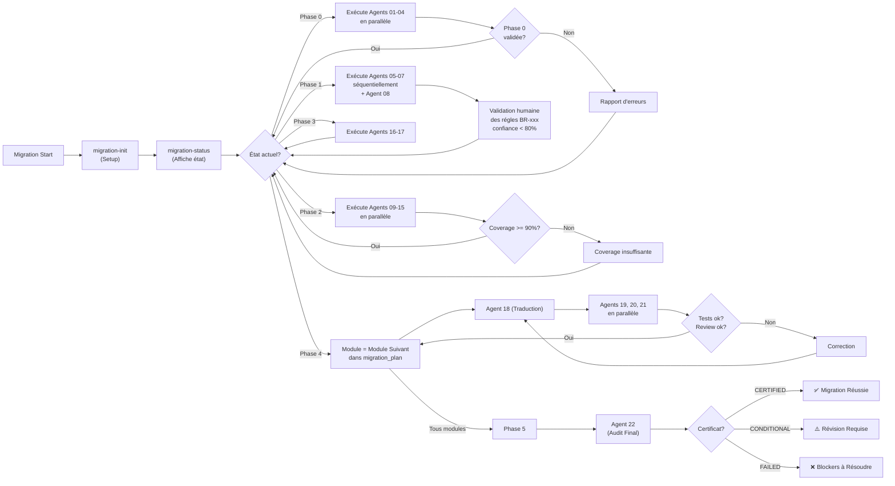
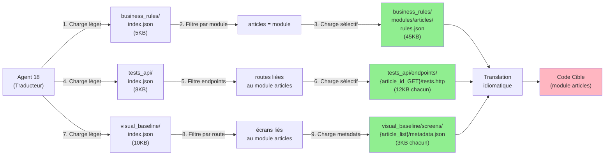
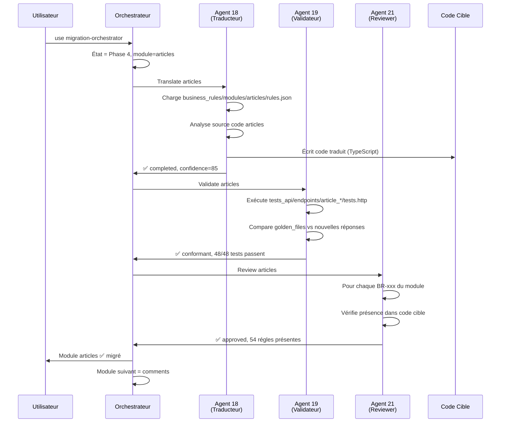

# Migration Legacy Fullstack — Framework Complet

> **Un framework d'IA génériste et modulaire pour migrer une application legacy avec garantie de conformité métier, sans perte de fonctionnalité et sans ajout involontaire.**

---

## 🎯 Vision

Migrer une application legacy d'une pile technologique à une autre est risqué. Les régles métier sont dispersées dans le code, implicites, non documentées. Sans preuves, on ne peut pas affirmer que la migration est conforme.

Ce framework change l'équation :

✅ **Extraction exhaustive** : toutes les régles métier sont formalisées et cataloguées  
✅ **Filet de sécurité** : une suite de tests agnostiques à l'implémentation est construite AVANT la migration  
✅ **Garantie de conformité** : chaque module migré est validé contre ce filet — zéro perte, zéro ajout  
✅ **Auditabilité** : chaque décision est traçable, citée, argumentée  
✅ **Incrementalité** : migration module par module avec coexistence (Strangler Fig)  
✅ **Validation croisée** : audit final exhaustif post-migration  

**Résultat** : un certificat de migration (CERTIFIED / CONDITIONAL / FAILED) signé par l'IA et validable par l'humain.

---

## 🏗️ Architecture Globale

Le framework est composé de **24 agents spécialisés** orchestrés en **6 phases**, produisant des **artefacts structurés** stockés dans `./migration-state/`.

```
┌─────────────────────────────────────────────────────────────────┐
│                    PHASE 0: Audit & Inventaire                  │
│              (Agents 01-04: Cartographie, Routes, DB, Métriques) │
│                    ↓ Produit: Structure + Graphe                │
└─────────────────────────────────────────────────────────────────┘
                              ↓
┌─────────────────────────────────────────────────────────────────┐
│              PHASE 1: Extraction des Régles Métier               │
│    (Agents 05-07: Régles, Workflows, RBAC + Documentation)      │
│              ↓ Produit: Catalogue des Régles Métier             │
└─────────────────────────────────────────────────────────────────┘
                              ↓
┌─────────────────────────────────────────────────────────────────┐
│          PHASE 2: Construction du Harnais de Tests               │
│  (Agents 09-15: Tests API, E2E, Golden Files, Baseline Visuelle) │
│        ↓ Produit: Filet de Sécurité = Régles Métier Testées     │
└─────────────────────────────────────────────────────────────────┘
                              ↓
┌─────────────────────────────────────────────────────────────────┐
│              PHASE 3: Conception de l'Architecture               │
│           (Agents 16-17: Tech Mapping + Plan de Migration)       │
│         ↓ Produit: Stratégie et Ordre de Migration               │
└─────────────────────────────────────────────────────────────────┘
                              ↓
┌─────────────────────────────────────────────────────────────────┐
│        PHASE 4: Migration Incrémentale (Module par Module)       │
│   (Agents 18-21: Traduction, Validation, Review, Shadow Mode)   │
│              ↓ Produit: Application Cible Migrée                │
└─────────────────────────────────────────────────────────────────┘
                              ↓
┌─────────────────────────────────────────────────────────────────┐
│           PHASE 5: Validation Croisée & Audit Final              │
│   (Agents 22-24: Audit, Features Fantômes, Diff API)            │
│        ↓ Produit: Certificat de Migration (CERTIFIED)           │
└─────────────────────────────────────────────────────────────────┘
```

---

## 📊 Les 24 Agents du Framework

### Phase 0 — Audit & Inventaire
| Agent | Rôle | Entrée | Sortie |
|-------|------|--------|--------|
| **01 Cartographe** | Parse le code, construit le graphe de dépendances | Code source | Graphe, modules, dépendances |
| **02 Analyseur Routes** | Extrait toutes les routes/endpoints (frontend + backend) | Code source | Catalogue des routes (HTTP + navigation) |
| **03 Inventaire DB** | Analyse schemas, migrations, requêtes | Code source + migrations | Schema ER, catalogue requêtes |
| **04 Métriques** | Calcule la complexité cyclomatique, le couplage | Code source | Métriques par module, ordre de migration suggéré |

### Phase 1 — Extraction des Régles Métier
| Agent | Rôle | Entrée | Sortie |
|-------|------|--------|--------|
| **05 Extracteur Régles** | Formalise chaque régles métier du code | Code source | Catalogue BR-001, BR-002, ... (formalisé) |
| **06 Extracteur Workflows** | Identifie enchainements d'états et transitions | Code source | Diagrammes de flux, machines à états |
| **07 Extracteur RBAC** | Extrait matrice de permissions (rôles x ressources) | Code source | Matrice de permissions centralisée |
| **08 Documenteur** | Agrège tout en documentation navigable | Sorties 05-07 | Documentation HTML/Markdown avec index |

### Phase 2 — Construction du Harnais de Tests
| Agent | Rôle | Entrée | Sortie |
|-------|------|--------|--------|
| **09 Générateur Tests API** | Tests de contrat pour chaque endpoint | Routes + régles + RBAC | Tests API (HTTP, Postman, Jest, etc.) |
| **10 Générateur Tests E2E** | Scenarios E2E à partir des workflows | Workflows | Scripts Playwright/Cypress |
| **11 Golden File** | Capture les réponses de référence | Application legacy running | Fichiers de référence normalisés |
| **12 Recorder HTTP** | Enregistre le trafic réel | Trafic applicatif réel | Cas de test dérivés (HAR) |
| **13 Navigateur Visuel** | Capture la baseline visuelle (screenshots) | Application legacy running | Catalogue d'écrans avec annotations |
| **14 Comparateur Visuel** | Diff pixel avant/après migration | Baseline legacy + app migrée | Rapport de regressions visuelles |
| **15 Couverture Métier** | Mesure % régles métier couvertes par tests | Tests + catalogue régles | Rapport de couverture metier |

### Phase 3 — Architecture Cible
| Agent | Rôle | Entrée | Sortie |
|-------|------|--------|--------|
| **16 Mappeur Techno** | Table de correspondance source → cible | Inventaire + technos source/cible | Mapping patterns (e.g. Eloquent → JPA) |
| **17 Planificateur** | Détermine l'ordre optimal de migration des modules | Graphe dépendances + métriques | Plan de migration ordonné |

### Phase 4 — Migration Incrémentale (par Module)
| Agent | Rôle | Entrée | Sortie |
|-------|------|--------|--------|
| **18 Traducteur** | Traduit le code d'un module source → cible | Code source module + régles métier | Code cible idiomatique |
| **19 Validateur Conformité** | Exécute tests et compare golden files | Tests + golden files | Rapport de conformité (diff sémantique) |
| **20 Comparateur Réponses** | Compare shadow mode (ancien vs nouveau) | Trafic dupliqué | Rapport divergences temps réel |
| **21 Revieweur Migration** | Vérifie chaque régles métier présente et non altérée | Code migré + catalogue régles | Rapport de review (par régles) |

### Phase 5 — Validation Finale
| Agent | Rôle | Entrée | Sortie |
|-------|------|--------|--------|
| **22 Audit Final** | Validation exhaustive post-migration (100%) | Tout le code cible + tous les catalogues | **Certificat de migration** (CERTIFIED / CONDITIONAL / FAILED) |
| **23 Détecteur Features Fantômes** | Détecte tout code ajouté en cible non présent en source | Code source + code cible | Liste des ajouts non prévus |
| **24 Comparateur Surface API** | Diff structurel des APIs source vs cible | Catalogues routes source + cible | Rapport API_DIFF (breaking changes ?) |

---

## 🔄 Orchestration: Agent Orchestrateur Principal

L'agent `migration-orchestrator` dirige le workflow :



### Exécution
```bash
# Initialiser le projet
use migration-init

# Afficher l'état et exécuter l'étape suivante
use migration-orchestrator

# Vérifier l'état à tout moment
use migration-status
```

---

## 💾 Architecture du Stockage : Index + Chunking

### Problème Résolu
Les sorties brutes (100s de tests, 100s d'écrans, 1000s de régles) créent une **surcharge contexte** : les agents Phase 4/5 ne pourraient pas charger toutes les données en mémoire. ❌

### Solution: Index + Chunking
Chaque phase découpe ses données en **fichiers modulaires** + **index légers** :

```
./migration-state/
├── phase1/
│   ├── business_rules/
│   │   ├── index.json                    # 📋 Liste légère des modules
│   │   ├── summary.json                  # 📊 Stats globales
│   │   └── modules/
│   │       ├── {module_name}/
│   │       │   ├── rules.json            # 🔍 CHARGEMENT SÉLECTIF
│   │       │   └── summary.json          # Stats du module
│   │       └── ...
│   ├── workflows/
│   │   ├── index.json                    # 📋 Liste workflows
│   │   ├── summary.json                  # 📊 Stats
│   │   └── {wf_id}/
│   │       ├── workflow.json             # 🔍 Définition complète
│   │       └── metadata.json
│   └── rbac_matrix/
│       ├── index.json                    # 📋 Navigation rôles/ressources
│       ├── matrix.json                   # 🔍 Matrice centralisée (cross-tab)
│       └── summary.json
│
├── phase2/
│   ├── tests_api/
│   │   ├── index.json                    # 📋 Endpoints + stats
│   │   ├── summary.json
│   │   └── endpoints/
│   │       └── {endpoint_slug}/
│   │           ├── tests.http            # 🔍 Tests de cet endpoint
│   │           └── metadata.json
│   │
│   ├── golden_files/
│   │   ├── index.json
│   │   ├── summary.json
│   │   └── endpoints/
│   │       └── {endpoint_slug}/
│   │           ├── golden.json           # 🔍 Réponses normalisées
│   │           └── metadata.json
│   │
│   └── visual_baseline/
│       ├── index.json
│       ├── summary.json
│       └── screens/
│           └── {route_slug}__{state}__{role}__{viewport}/
│               ├── screenshot.png        # 🔍 Image baseline
│               └── metadata.json
│
└── phase3/
    ├── tech_mapping.json
    └── migration_plan.json

# Phase 4/5 : Chargement par module seulement
phase4/
└── modules/
    └── {module_name}/
        ├── translation_log.json
        ├── review_report.json
        ├── conformity_report.json
        └── visual_diff.json              # Diff avant/après ce module
```

### Selectivité de Chargement (Core Innovation)

**Agent Phase 4 migrant le module `articles`** :



**Impact** :
- ❌ Sans index+chunking: 50MB chargés → OOM ou timeout
- ✅ Avec index+chunking: ~2-3MB seulement pour le module → agent libéré

---

## 🎯 Avantages du Framework

### 1️⃣ Conformité Métier Certifiée
```
Avant (legacy):          Après (migration):
   BR-042          →        BR-042
   (code source)            (code cible)
   Interprétation            Vérifiée par:
   manuelle                  - Tests de contrat
   = Risque                  - Review de code
   de dérive                 - Audit final
                            = Zéro risque de dérive
```

### 2️⃣ Zéro Ajout de Fonctionnalité
L'agent **Détecteur de Features Fantômes** (Agent 23) garantit qu'aucun code n'a été ajouté:
```
Code Cible \ Code Source = ? (doit être ∅)
```

### 3️⃣ Auditabilité Complète
Chaque décision est citée :
```json
{
  "rule_id": "BR-042",
  "status": "present",
  "target_location": {
    "file": "src/modules/articles/validators.ts",
    "line": 87
  },
  "source_location": {
    "file": "app/Rules/ArticleValidation.php",
    "line": 142
  }
}
```
→ L'auditeur peut vérifier le code exact

### 4️⃣ Parcours Utilisateur Validé
La **baseline visuelle** (Agent 13) capture TOUS les écrans. Le **comparateur visuel** (Agent 14) détecte les regressions:
- ✅ Layout préservé
- ✅ Contenu identique
- ❌ Bouton déplacé → alerte

### 5️⃣ Tests Agnostiques à l'Implémentation
Les tests ne dépendent PAS de la techno source/cible:
```http
@baseUrl = {{BASE_URL}}

### GET /api/articles/1 - Succès
GET {{baseUrl}}/api/articles/1
Authorization: Bearer {{token}}

HTTP/1.1 200
Content-Type: application/json

{
  "id": "{{ARTICLE_ID}}",
  "title": "string",
  "author": "string"
}
```
→ Tourne contre legacy ET contre cible sans modification

### 6️⃣ Incrementalité = Rollback Facile
Migration module par module :
```
Semaine 1: Module A migré ✅
Semaine 2: Module B migré ✅
Semaine 3: Module C migré ✅
Semaine 4: Module C détecte un bug → Rollback rapide
```
→ Risque confiné à 1 module, pas l'app entière

### 7️⃣ Confiance Chiffrée
Chaque sortie inclut un score de confiance:
```
"confidence": 87  # Très confiant (87/100)
```
Tout < 80% = **Validation humaine requise** → Garantit la participation de l'expert métier

---

## 📋 Workflow Détaillé: Exemple Module `articles`

### Scénario: Migration du module `articles` (Phase 4)



### État dans `state.json`
```json
{
  "module_progress": {
    "articles": {
      "status": "validated",
      "translated_at": "2026-04-15T14:30:00Z",
      "review": "approved",
      "conformity": "conformant",
      "confidence": 85
    }
  },
  "agents": {
    "18-traducteur": {
      "status": "completed",
      "last_run": "2026-04-15T14:25:00Z",
      "output_files": ["phase4/modules/articles/translation_log.json"]
    }
  }
}
```

---

## 🚀 Démarrage Rapide

### 1. Initialiser un nouveau projet
```bash
# Au répertoire racine de la repo
use migration-init
```
Remplit `./migration-state/config.json` avec :
- Répertoire source (legacy)
- Répertoire cible (nouvelle techno)
- URLs de test
- Credentials

### 2. Lancer le workflow
```bash
use migration-orchestrator
```
L'agent détermine la prochaine étape et l'exécute. Boucle jusqu'à completion.

### 3. Monitoriser
```bash
use migration-status
```
Affiche :
- ✅ Phases complétées
- 🔄 Phases en cours
- ⏳ Phases à faire
- 🚫 Blockers
- % progression globale

### 4. Audit Final
Quand tous les modules sont traduits/validés :
```bash
use migration-22-audit-final
```
Produit :
```json
{
  "certification": "CERTIFIED",
  "summary": {
    "total_rules": 150,
    "rules_confirmed": 150,
    "rules_missing": 0,
    "confidence": 92
  }
}
```

---

## 🔍 Exemple d'Artefact: Rapport de Conformité

```json
{
  "generated_at": "2026-04-15T14:30:00Z",
  "module": "articles",
  "agent": "19-validateur",
  "status": "conformant",
  "confidence": 89,
  
  "tests_summary": {
    "total": 48,
    "passed": 48,
    "failed": 0
  },
  
  "golden_files_comparison": [
    {
      "endpoint": "GET /api/articles/1",
      "status": "identical",
      "response_time_legacy_ms": 45,
      "response_time_target_ms": 38,
      "performance_verdict": "acceptable"
    }
  ],
  
  "rules_covered": [
    "BR-042", "BR-043", "BR-044", "BR-045",
    "BR-051", "BR-052"
  ],
  
  "notes": "Tous les tests passent. Réponses identiques. Performance légèrement améliorée."
}
```

---

## 📈 Métriques de Suivi

Le `state.json` maintient des KPIs temps réel :

| Métrique | Formule | Cible |
|----------|---------|--------|
| **% Modules migrés** | Modules validés / Total | 100% |
| **% Régles couvertes par tests** | Régles testées / Régles catalogue | 90%+ |
| **Confiance moyenne** | Moyenne des scores de confiance | 80%+ |
| **Tests passants** | Tests passed / Tests total | 100% |
| **Regressions visuelles** | Écrans divergents / Écrans total | 0% (acceptable) |
| **Performance** | P50/P95/P99 cible vs legacy | ±10% |
| **Features fantômes** | Ajouts non justifiés | 0 |

Dashboard du `migration-status`:
```
╔════════════════════════════════════════════════════════════════╗
║                  MIGRATION STATUS DASHBOARD                     ║
╠════════════════════════════════════════════════════════════════╣
║  Phase 0: ✅ COMPLETED (4/4 agents)                             ║
║  Phase 1: ✅ COMPLETED (3/3 agents, validation humaine ok)      ║
║  Phase 2: ✅ COMPLETED (7/7 agents, coverage 92%)               ║
║  Phase 3: ✅ COMPLETED (2/2 agents)                             ║
║  Phase 4: 🔄 IN PROGRESS (6/12 modules migrés)                  ║
║      ├─ articles      ✅ validated                              ║
║      ├─ comments      ✅ validated                              ║
║      ├─ users         ✅ validated                              ║
║      ├─ auth          ✅ validated                              ║
║      ├─ notifications ✅ validated                              ║
║      ├─ payments      ✅ validated                              ║
║      ├─ reports       🔄 translating (85%)                      ║
║      └─ ...           ⏳ pending                                 ║
║  Phase 5: ⏳ PENDING                                             ║
║                                                                 ║
║  🎯 Overall Progress: 73%                                       ║
║  💡 Next: Continue phase 4 (reports module)                     ║
║  🚫 Blockers: None                                              ║
╚════════════════════════════════════════════════════════════════╝
```

---

## 🛡️ Sécurité & Validation

### Règle: "Missing = BLOCKER"
```
Si une régles métier BR-042 est absente du code cible :
  → BLOCKER automatique
  → Trace dans `state.json > blockers`
  → Certificat = FAILED jusqu'à résolution
```

### Validation Humaine Requise
```
Si confidence(regle) < 80% :
  → Agent signale avec `requires_human_validation: true`
  → Orchestrateur demande validation explicite
  → Pas de progression sans validation
```

### Audit Trail Complet
```json
{
  "log": [
    {
      "timestamp": "2026-04-15T14:30:00Z",
      "agent": "18-traducteur",
      "action": "translate",
      "module": "articles",
      "status": "completed",
      "confidence": 85,
      "decision": "Code traduit idiomatiquement en TypeScript"
    }
  ]
}
```

---

## 🎓 Apprentissages Clés

### 1. Extraction > Traduction
L'ordre critique:
```
✅ Extraire régles métier d'abord (Phase 1)
   ↓
✅ Tester les régles (Phase 2)
   ↓
✅ Puis traduire (Phase 4)
   ↓
❌ Si traduction en premier → chasse aux bugs infini
```

### 2. Index + Chunking = Scalabilité
```
Sans index:     Phase 2 = 50MB → OOM
Avec index:     Phase 2 = 2MB/module → Fast
```

### 3. Agnosticisme des Tests
```
Tests = Contrat, pas implémentation
→ Même tests contre legacy ET cible
→ Zéro réécriture pendant migration
```

### 4. Confiance Chiffrée
```
Tout < 80% = Validation humaine
→ IA génère, humain valide
→ Pas de boîte noire
```

---

## 📚 Structure de Répertoires Complète

```
d:\workspace\migration IA\
│
├── .claude/                                 # TEMPLATES & CONFIG
│   ├── README.md                           # 👈 Vous êtes ici
│   ├── migration-state/                    # TEMPLATES (pristine)
│   │   ├── state.json                      # Template skeleton
│   │   └── config.json                     # Template config
│   │
│   ├── agents/                             # DÉFINITIONS DES 24 AGENTS
│   │   ├── migration-init.md
│   │   ├── migration-orchestrator.md
│   │   ├── migration-status.md
│   │   ├── migration-01-cartographe.md
│   │   ├── ...
│   │   └── migration-24-comparateur-api.md
│   │
│   └── plans/                              # PLANS D'IMPLÉMENTATION
│       └── [plans générés par EnterPlanMode]
│
├── migration-state/                        # COPIE DE TRAVAIL (créée par init)
│   ├── state.json                          # État général (maintenu par orchestrateur)
│   ├── config.json                         # Configuration du projet
│   │
│   ├── phase0/                             # Audit & Inventaire
│   │   ├── structure.json
│   │   ├── routes_catalog.json
│   │   ├── db_schema.json
│   │   └── metrics.json
│   │
│   ├── phase1/                             # Extraction régles métier
│   │   ├── index.json                      # Meta-index
│   │   ├── business_rules/
│   │   │   ├── index.json                  # Index léger modules
│   │   │   ├── summary.json                # Stats globales
│   │   │   └── modules/
│   │   │       ├── articles/
│   │   │       │   ├── rules.json
│   │   │       │   └── summary.json
│   │   │       └── ...
│   │   ├── workflows/
│   │   │   ├── index.json
│   │   │   ├── summary.json
│   │   │   └── {wf_id}/
│   │   │       ├── workflow.json
│   │   │       └── metadata.json
│   │   ├── rbac_matrix/
│   │   │   ├── index.json
│   │   │   ├── matrix.json
│   │   │   └── summary.json
│   │   └── documentation/                  # Docs générées
│   │       └── index.html
│   │
│   ├── phase2/                             # Tests & Baseline
│   │   ├── tests_api/
│   │   │   ├── index.json
│   │   │   ├── summary.json
│   │   │   └── endpoints/{endpoint_slug}/
│   │   │       ├── tests.http
│   │   │       └── metadata.json
│   │   ├── golden_files/
│   │   │   ├── index.json
│   │   │   ├── summary.json
│   │   │   └── endpoints/{endpoint_slug}/
│   │   │       ├── golden.json
│   │   │       └── metadata.json
│   │   └── visual_baseline/
│   │       ├── index.json
│   │       ├── summary.json
│   │       └── screens/{route_slug}__{state}__{role}__{viewport}/
│   │           ├── screenshot.png
│   │           └── metadata.json
│   │
│   ├── phase3/                             # Architecture
│   │   ├── tech_mapping.json
│   │   └── migration_plan.json
│   │
│   ├── phase4/                             # Migration (par module)
│   │   └── modules/
│   │       ├── articles/
│   │       │   ├── translation_log.json
│   │       │   ├── review_report.json
│   │       │   ├── conformity_report.json
│   │       │   └── visual_diff.json
│   │       └── ...
│   │
│   └── phase5/                             # Validation finale
│       ├── audit_final.json
│       ├── ghost_features.json
│       └── api_diff.json
│
├── source/                                 # CODE LEGACY (path config.json > source.directory)
│   ├── app/
│   ├── config/
│   ├── database/
│   └── ...
│
├── target/                                 # CODE CIBLE (path config.json > target.directory)
│   ├── src/
│   ├── config/
│   └── ...
│
└── README.md                               # Ce fichier
```

---

## 🔗 Liens Utiles

- **CLAUDE.md** : Instructions du projet (dans la codebase)
- **state.json** : L'état vérité, maintenu en temps réel
- **config.json** : Configuration du projet (chemins, technos, URLs)

---

## 📞 Support

Pour toute question sur le framework :
1. Vérifiez `migration-status` (l'état courant)
2. Consultez la définition de l'agent relevant (`.claude/agents/migration-XX.md`)
3. Lisez les artefacts générés dans `migration-state/` pour tracer les décisions

---

**Framework Version**: 1.0  
**Last Updated**: 2026-04-15  
**Status**: Production-Ready
