# Migrer sans Régresser — Une Méthode Agentique pour les Applications Legacy

> *Ce document présente une méthode de migration incrémentale s'appuyant sur 24 agents IA spécialisés.  
> Les exemples et métriques sont issus d'une migration réelle : Django 5.2 / HTMX → une SPA TypeScript / Fastify + Angular 21.  
> Verdict de certification : **CERTIFIED (97%)** — 0 breaking change API, 90/90 tests, 0 régression visuelle.*

---

## Table des matières

1. [Le problème réel des migrations](#1-le-problème-réel-des-migrations)
2. [Le principe fondateur : capturer la vérité avant de toucher au code](#2-le-principe-fondateur--capturer-la-vérité-avant-de-toucher-au-code)
3. [Architecture générale — 5 phases, 24 agents](#3-architecture-générale--5-phases-24-agents)
4. [Phase 0 — Inventaire & métriques](#4-phase-0--inventaire--métriques)
5. [Phase 1 — Extraction des règles métier](#5-phase-1--extraction-des-règles-métier)
6. [Phase 2 — Le harnais de tests (filet de sécurité)](#6-phase-2--le-harnais-de-tests-filet-de-sécurité)
7. [Phase 3 — Architecture cible & plan de migration](#7-phase-3--architecture-cible--plan-de-migration)
8. [Phase 4 — Migration incrémentale module par module](#8-phase-4--migration-incrémentale-module-par-module)
9. [Phase 5 — Certification](#9-phase-5--certification)
10. [La chaîne de confiance](#10-la-chaîne-de-confiance)
11. [Le déploiement Strangler Fig](#11-le-déploiement-strangler-fig)
12. [Ce que le framework ne peut pas faire seul](#12-ce-que-le-framework-ne-peut-pas-faire-seul)
13. [Artefacts produits](#13-artefacts-produits)

---

## 1. Le problème réel des migrations

Migrer une application legacy est reconnu comme l'une des tâches les plus risquées en ingénierie logicielle. Non pas parce que le code cible est difficile à écrire, mais parce qu'il est difficile de savoir *quand on a terminé*.

Le problème présente plusieurs dimensions simultanées :

### La connaissance tacite

Dans tout système legacy d'une certaine maturité, une partie du comportement métier n'est plus documentée. Elle vit dans le code — parfois dans des conditions imbriquées, parfois dans un ordre d'exécution non évident, parfois dans un effet de bord d'un ORM. Cette connaissance tacite est la première cause de régression lors d'une migration.

```python
# Exemple typique : une règle enterrée dans une vue Django
def comment_delete_view(request, slug, comment_id):
    comment = get_object_or_404(Comment, id=comment_id)
    article = get_object_or_404(Article, slug=slug)
    # ← Cette condition dit "OU auteur article" — pas juste "auteur du commentaire"
    if comment.author != request.user and article.author != request.user:
        return HttpResponseForbidden()
```

Un développeur qui traduit cette vue sans lire soigneusement la condition `and` (équivalent logique de `NOT (A OR B)`) produira un système qui rejette la suppression par l'auteur de l'article. Zéro test existant ne le détectera, parce que le test n'a jamais existé.

### L'absence de tests de contrat

La majorité des applications legacy ont peu ou pas de tests automatisés. Même quand des tests existent, ils testent rarement le comportement de l'API de bout en bout dans tous les scénarios (utilisateur anonyme, propriétaire, tiers). La migration est donc souvent validée par des tests écrits *après* la migration — sur la compréhension du développeur, pas sur la vérité du legacy.

### Les incompatibilités architecturales cachées

Certaines incompatibilités ne deviennent visibles qu'en fin de sprint :
- Les mots de passe Django utilisent PBKDF2. Le port Node.js utilisera probablement bcrypt. Ils sont incompatibles — les utilisateurs existants ne peuvent plus se connecter.
- Django `django-taggit` preserve la casse des tags. Si la cible les normalise en minuscule, les données de production sont altérées silencieusement.
- Le format de date Python `'F j, Y'` (ex : `April 29, 2026`) n'est pas le même que l'Angular pipe `'longDate'` qui peut produire `Tuesday, April 29, 2026`.

Ces problèmes ne sont pas des bugs de développement. Ce sont des incompatibilités de spécification non détectées.

### Le diagramme du problème

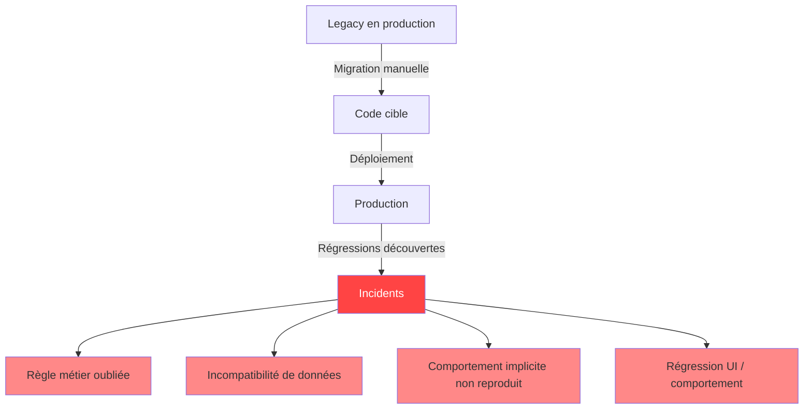

La méthode présentée ici traite chacun de ces risques systématiquement, *avant* de commencer à écrire le code cible.

---

## 2. Le principe fondateur : capturer la vérité avant de toucher au code

La méthode repose sur un principe simple : **le système legacy en production EST la spécification**. Tout ce qu'il fait, même silencieusement, constitue une obligation contractuelle envers ses utilisateurs.

La conséquence directe est une règle d'or :

> **Toute règle de comportement doit être formalisée et testée sur le legacy avant que la première ligne du code cible soit écrite.**

Cette règle a deux implications pratiques :

1. Les **tests sont écrits contre le legacy** d'abord. Ils passent en vert sur le système source. Après migration, ils doivent passer en vert sur la cible. Si un test échoue sur la cible, c'est une régression — pas une ambiguïté.

2. Les **règles métier sont extraites et documentées** avec leur localisation dans le code source. Chaque règle a un identifiant (`BR-023`), un niveau de confiance, et un statut de couverture. Une règle sans test est une dette à résoudre avant la certification.

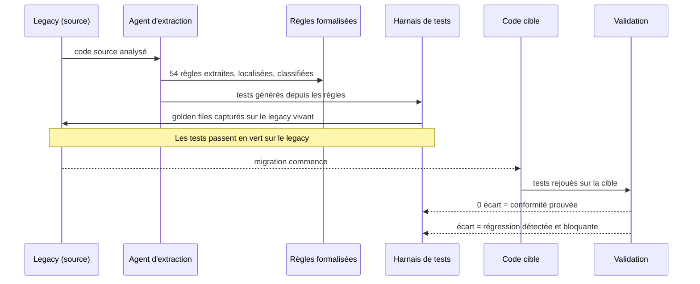

---

## 3. Architecture générale — 5 phases, 24 agents

Le framework est structuré en 5 phases ordonnées, chacune constituant un prérequis absolu de la suivante. L'orchestrateur maintient l'état global et contrôle les transitions.

```mermaid
flowchart LR
    subgraph P0["Phase 0 — Inventaire"]
        A01[01 Cartographe]
        A02[02 Routes]
        A03[03 DB Schema]
        A04[04 Métriques]
    end

    subgraph P1["Phase 1 — Règles métier"]
        A05[05 Règles]
        A06[06 Workflows]
        A07[07 RBAC]
        A08[08 Documentation]
    end

    subgraph P2["Phase 2 — Harnais de tests"]
        A09[09 Tests API]
        A10[10 Tests E2E]
        A11[11 Golden files]
        A12[12 HTTP recorder]
        A13[13 Baseline visuelle]
        A14[14 Diff visuel]
        A15[15 Couverture métier]
    end

    subgraph P3["Phase 3 — Architecture"]
        A16[16 Tech mapping]
        A17[17 Planificateur]
    end

    subgraph P4["Phase 4 — Migration"]
        A18[18 Traducteur]
        A19[19 Validateur]
        A20[20 Shadow mode]
        A21[21 Reviewer]
    end

    subgraph P5["Phase 5 — Certification"]
        A22[22 Audit final]
        A23[23 Features fantômes]
        A24[24 Surface API]
    end

    P0 --> P1 --> P2 --> P3 --> P4 --> P5
```

### Parallélisme intra-phase

Certains agents à l'intérieur d'une phase sont indépendants et peuvent s'exécuter en parallèle pour réduire la durée totale :

```mermaid
gantt
    title Séquence d'exécution par phase
    dateFormat X
    axisFormat %s

    section Phase 0
    01 Cartographe       :a1, 0, 2
    02 Routes            :a2, 0, 2
    03 DB Schema         :a3, 0, 2
    04 Métriques         :a4, 0, 2

    section Phase 1
    05 Règles            :b1, 2, 4
    06 Workflows         :b2, 4, 6
    07 RBAC              :b3, 4, 6
    08 Documentation     :b4, 6, 7

    section Phase 2
    09 Tests API         :c1, 7, 9
    10 Tests E2E         :c2, 7, 9
    11 Golden files      :c3, 7, 9
    12 HTTP recorder     :c4, 7, 9
    13 Baseline visuelle :c5, 7, 9
    14 Diff visuel       :c6, 9, 10
    15 Couverture        :c7, 10, 11

    section Phase 3
    16 Tech mapping      :d1, 11, 13
    17 Planificateur     :d2, 11, 13

    section Phase 4 par module
    18 Traducteur        :e1, 13, 16
    19+21 Valid+Review   :e2, 16, 18
    20 Shadow mode       :e3, 18, 19

    section Phase 5
    22+23+24 Audit       :f1, 19, 21
```

### Gestion d'état partagé

Tous les agents sont **stateless**. Ils lisent leurs entrées depuis l'état partagé, produisent leurs sorties, et mettent à jour `state.json`. L'orchestrateur est le seul à autoriser les transitions de phase.

```
migration-state/
  state.json          ← état global (phases, agents, log d'actions horodaté)
  config.json         ← configuration projet (stacks, URLs, credentials)
  phase0/             ← artefacts produits par agents 01-04
  phase1/             ← artefacts produits par agents 05-08
  phase2/             ← artefacts produits par agents 09-15
  phase3/             ← artefacts produits par agents 16-17
  phase4/modules/     ← artefacts par module (agents 18-21)
  phase5/             ← artefacts produits par agents 22-24
```

---

## 4. Phase 0 — Inventaire & métriques

Avant toute décision, il faut comprendre ce qu'on migre. Les 4 agents de Phase 0 travaillent en parallèle et produisent une radiographie complète du système legacy.

### Pourquoi une phase d'inventaire dédiée ?

La tendance naturelle est de commencer à "écrire le code cible" immédiatement. L'inventaire semble être une perte de temps. En réalité, c'est la phase qui évite le plus de retravail : sans elle, on découvre en milieu de sprint qu'une table a des colonnes calculées non documentées, que deux modules ont un couplage cyclique qui impose un ordre de migration précis, ou qu'on a sous-estimé par 3× le module le plus complexe.

### Ce que produit chaque agent

**Agent 01 — Cartographe** : graphe de dépendances (modules, fichiers, imports). Identifie le chemin critique de migration par analyse topologique.

**Agent 02 — Analyseur de routes** : catalogue exhaustif de tous les endpoints. Pour chaque route : méthode HTTP, handler, paramètres, authentification requise. C'est la source de vérité pour la génération des tests en Phase 2.

**Agent 03 — Inventaire DB** : schéma complet avec types, contraintes, relations M2M, valeurs par défaut, comportements CASCADE. Révèle les dépendances de données qui contraignent l'ordre de migration.

**Agent 04 — Métriques** : complexité cyclomatique par fonction, couplage afférent/efférent (Ca/Ce), indice d'instabilité de Martin. Ces métriques alimentent directement le planning de Phase 3.

### Les métriques guident la priorité

L'indice d'instabilité $I = \frac{C_e}{C_a + C_e}$ classe les modules par risque de migration :

| Valeur de I | Nature du module | Ordre de migration |
|-------------|------------------|--------------------|
| I ≈ 0 | Stable, très dépendant d'autres | **Migrer en premier** (fondations) |
| I ≈ 0.5 | Couplé dans les deux sens | Migrer avec adaptateurs de coexistence |
| I ≈ 1 | Instable, peu de dépendants | **Migrer en dernier** (feuilles) |

Sur la migration Conduit, cela a produit l'ordre suivant :

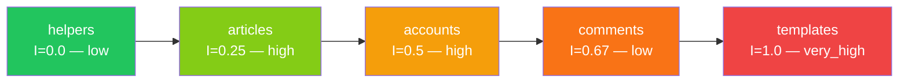

*helpers* en premier (fondations de tout), *templates* en dernier (dépendent de tout le reste).

---

## 5. Phase 1 — Extraction des règles métier

C'est la phase qui différencie le plus cette méthode d'une migration ad hoc. Elle répond à la question : **qu'est-ce que ce système est supposé faire, formellement ?**

### La taxonomie des règles

Les règles extraites appartiennent à 6 types distincts :

| Type | Description | Exemple concret | Impact migration |
|------|-------------|-----------------|------------------|
| **validation** | Ce qui est accepté ou rejeté en entrée | "Le slug ne peut pas être modifié après création" | Test unitaire dédié |
| **authorization** | Qui peut faire quoi | "Seul l'auteur ou l'auteur de l'article peut supprimer un commentaire" | Middleware de contrôle d'accès |
| **transformation** | Comment la donnée est transformée | "Le markdown est rendu avec DOMPurify avant affichage" | Pipeline de rendu |
| **constraint** | Invariants de la base de données | "Deux articles ne peuvent pas avoir le même slug" | Contrainte UNIQUE |
| **workflow** | Séquence d'états valides | "Un article vide ne peut pas être publié" | Validation de formulaire |
| **calculation** | Valeurs dérivées | "following=true si l'utilisateur courant suit l'auteur" | Jointure en base |

Chaque règle est documentée avec son **identifiant**, son **niveau de confiance** (75%–99%), sa **localisation dans le code source**, et son **statut de couverture** (PRESENT / MISSING / DEFERRED_ACCEPTED / NOT_APPLICABLE).

### Le piège des règles implicites

Certaines règles ne sont pas immédiatement visibles. Elles émergent de combinaisons logiques que l'agent d'extraction identifie par analyse de flux de contrôle.

Exemple : la règle d'autorisation de suppression d'un commentaire.

```python
# Code legacy
if comment.author != request.user and article.author != request.user:
    return HttpResponseForbidden()
```

La logique de De Morgan s'applique :  
`NOT A AND NOT B` ≡ `NOT (A OR B)`  
La règle réelle est : **"autorisé si auteur du commentaire OU auteur de l'article"**.

Un traducteur inattentif écrirait `if (!isCommentAuthor || !isArticleAuthor)`, ce qui interdit l'accès à *tout le monde*. L'extraction formelle de la règle évite cette classe d'erreur.

```typescript
// Traduction correcte — BR-041 CRITICAL
const isCommentAuthor = comment.authorId === currentUser.id;
const isArticleAuthor = comment.article.authorId === currentUser.id;
if (!isCommentAuthor && !isArticleAuthor) {
  return reply.code(403).send({ errors: { body: ['Forbidden'] } });
}
```

Sur la migration Conduit : **54 règles extraites**, 12 autorisation, 12 validation, 14 transformation, 11 contrainte, 3 workflow, 2 calcul. Confiance moyenne : 94%.

### Les workflows comme machines à états

Les processus métier multi-étapes sont modélisés comme des machines à états. Cela capture non seulement les chemins nominaux mais tous les chemins d'erreur.

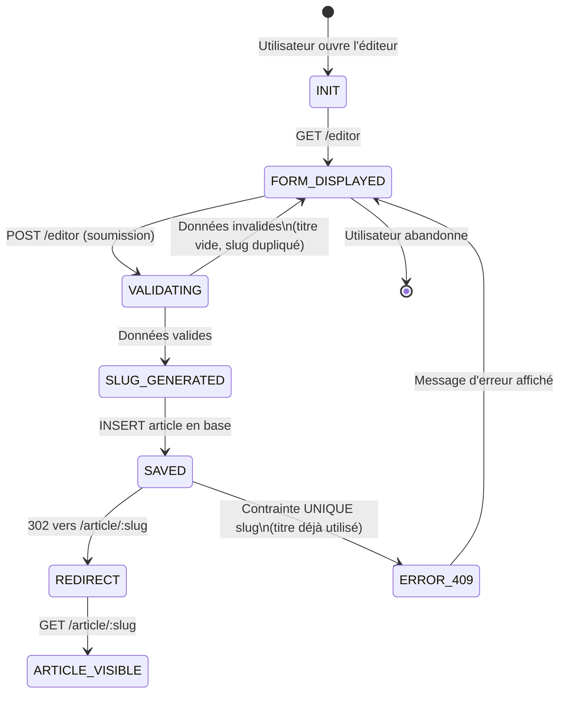

Sur la migration Conduit : **11 workflows** modélisés, **39 états**, **36 transitions**.

### La matrice RBAC

Chaque endpoint est croisé avec chaque rôle. Elle sert de spécification à la génération des tests (Phase 2) et de checklist à la validation (Phase 4).

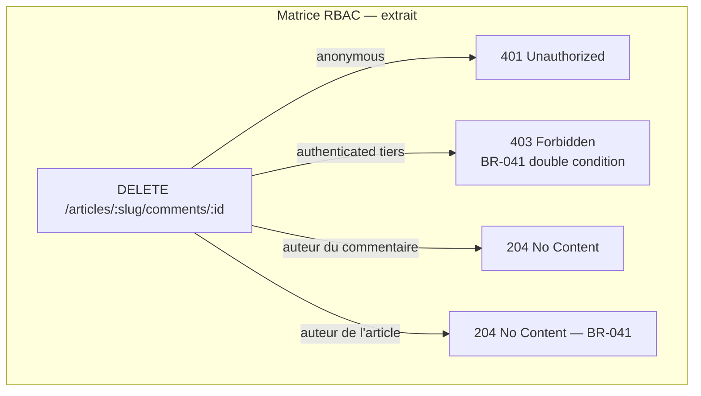

---

## 6. Phase 2 — Le harnais de tests (filet de sécurité)

C'est la phase qui rend la migration **réversible et vérifiable**. Elle produit un corpus de référence capturé sur le system legacy vivant — la définition formelle du "comportement correct".

### Cinq dimensions de capture simultanée

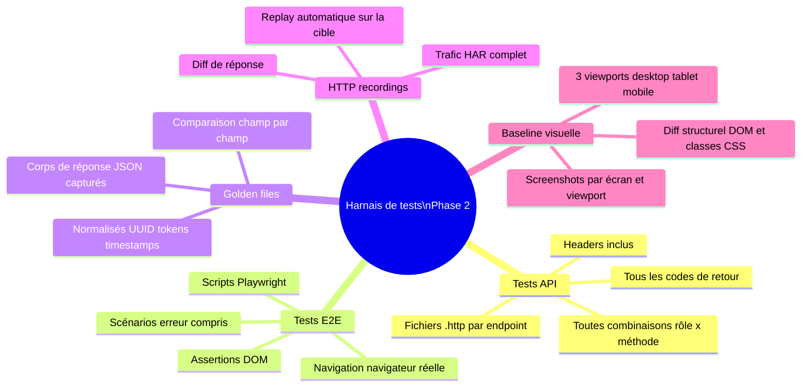

Sur la migration Conduit :

| Agent | Artefact | Volume |
|-------|----------|--------|
| 09 — Tests API | Fichiers `.http` par endpoint | 100 tests, 17 endpoints |
| 10 — Tests E2E | Scripts Playwright | 43 tests, 11 workflows |
| 11 — Golden files | Réponses JSON normalisées | 43 fichiers, 22 endpoints |
| 12 — Recorder HTTP | Trafic HAR | 133 enregistrements |
| 13 — Baseline visuelle | Screenshots références | 51 captures, 17 écrans, 3 viewports |

### La normalisation des golden files

Les réponses JSON contiennent des valeurs non-déterministes. Les golden files appliquent une normalisation systématique avant stockage :

```json
{
  "article": {
    "slug": "how-to-train-your-dragon",
    "title": "How to train your Dragon",
    "createdAt": "{{TIMESTAMP}}",
    "updatedAt": "{{TIMESTAMP}}",
    "author": {
      "username": "jake",
      "following": false
    }
  }
}
```

Règles de normalisation appliquées :
- `{{TIMESTAMP}}` : tout ISO 8601 valide
- `{{UUID}}` : tout UUID v4
- `{{SESSION_ID}}` : valeur de cookie sessionid
- `{{CSRF_TOKEN}}` : token CSRF form

La comparaison est **field-by-field**, pas string-match — ce qui tolère les différences d'ordre de clés JSON ou de formatage non significatives.

### La comparaison visuelle structurelle

L'agent de diff visuel (14) n'effectue pas un diff pixel-à-pixel (trop fragile aux variations de rendu de police). Il analyse la présence des éléments DOM et des classes CSS critiques.

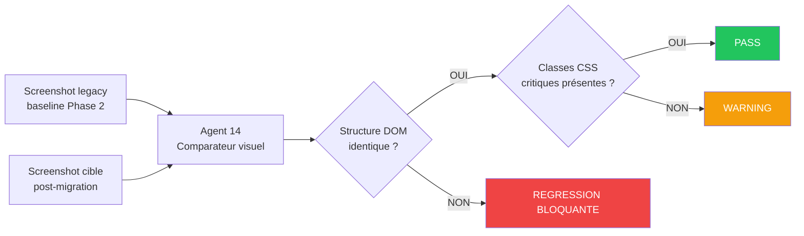

Sur la migration Conduit, deux régressions bloquantes détectées **avant déploiement** :
- Wrapper `.article-page > .banner` absent sur la page 404 article
- Bloc `.article-actions` manquant sous le contenu de l'article (doublon intentionnel du legacy)

### La couverture métier : fermer la boucle

L'agent 15 croise les règles extraites en Phase 1 avec les 5 types d'artefacts. Chaque règle doit être couverte par au moins un artefact. Un taux de couverture < 95% bloque le passage en Phase 3.

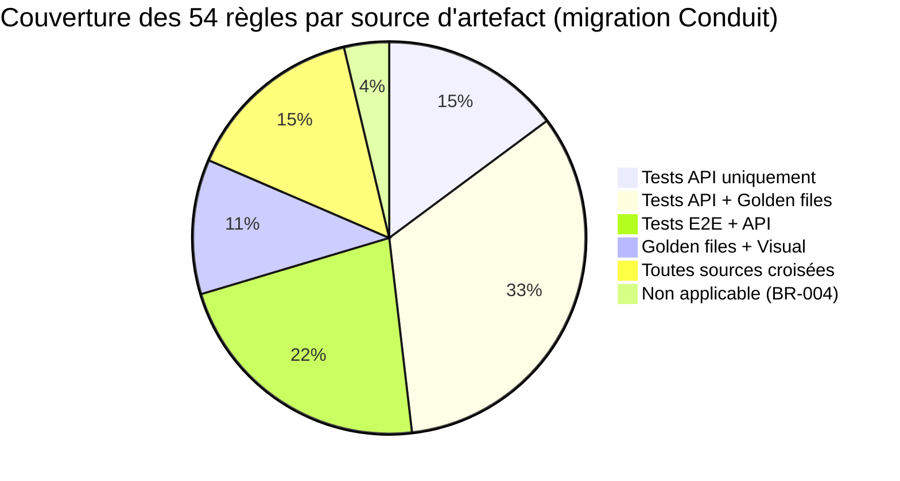

Résultat Conduit : **98.1% de couverture** — 1 règle non applicable (validateurs de password Django, sans équivalent SPA).

---

## 7. Phase 3 — Architecture cible & plan de migration

### Le mapping technologique

L'agent 16 produit une table de correspondance exhaustive entre chaque pattern du système source et son équivalent dans la stack cible. Chaque pattern est classifié selon son niveau de transformation nécessaire :

```mermaid
quadrantChart
    title Patterns technologiques — Effort vs Risque
    x-axis Faible effort --> Fort effort
    y-axis Faible risque --> Fort risque
    
    quadrant-1 Surveiller
    quadrant-2 Prioriser
    quadrant-3 Déléguer
    quadrant-4 Automatiser

    HTMX partials vs Angular: [0.6, 0.4]
    urlpatterns vs Fastify routes: [0.7, 0.8]
    Session cookie vs JWT: [0.8, 0.9]
    django-taggit vs Tag tables: [0.7, 0.7]
    slugify vs toLowerCase: [0.1, 0.1]
    uuid4 vs randomUUID: [0.1, 0.1]
    login_required vs preHandler: [0.4, 0.3]
    paginator vs LIMIT OFFSET: [0.3, 0.2]
    PBKDF2 vs bcrypt: [0.9, 1.0]
```

Les patterns dans le quadrant **haut-droit** (fort effort, fort risque) requièrent une **VALIDATION HUMAINE** avant de commencer la migration du module concerné.

Sur la migration Conduit : **32 patterns** identifiés — 5 directs, 18 adapt, 9 redesign, 1 unmappable.

**Exemple de pattern redesign documenté — TM-008 : Session → JWT**

| | Source (Django) | Cible (Fastify) |
|--|-----------------|-----------------|
| Authentification | Session cookie httpOnly | JWT Bearer 7 jours |
| Stockage | Server-side (DB ou Redis) | Client-side (localStorage) |
| Révocation | Immédiate (DELETE session) | Impossible sans blacklist |
| Hash passwords | PBKDF2 (Django iterations=870000) | bcrypt (coût=12) |
| **Incompatibilité** | — | ❌ Mots de passe existants invalides |
| **Décision requise** | — | Reset forcé vs re-hash lazy |

### La planification par chemin critique

L'agent 17 combine l'analyse topologique (Phase 0) et les métriques de complexité pour produire un plan de migration sprint par sprint.

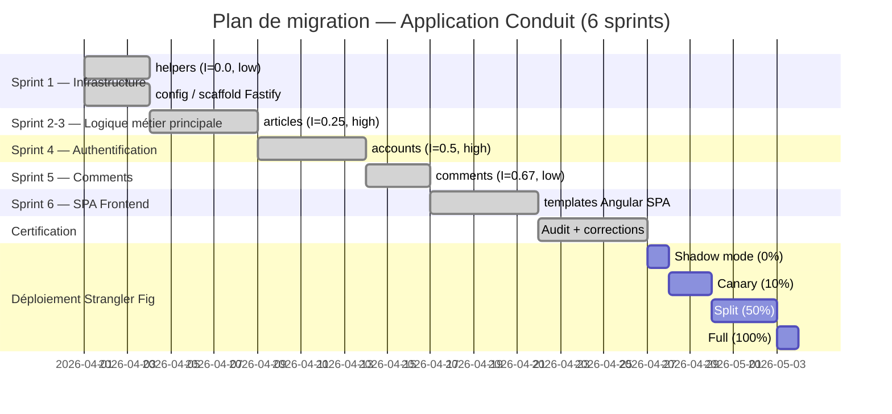

---

## 8. Phase 4 — Migration incrémentale module par module

La Phase 4 est la seule phase d'écriture de code. Elle s'appuie sur toutes les phases précédentes et dispose d'une boucle de validation continue à chaque module.

### La boucle par module

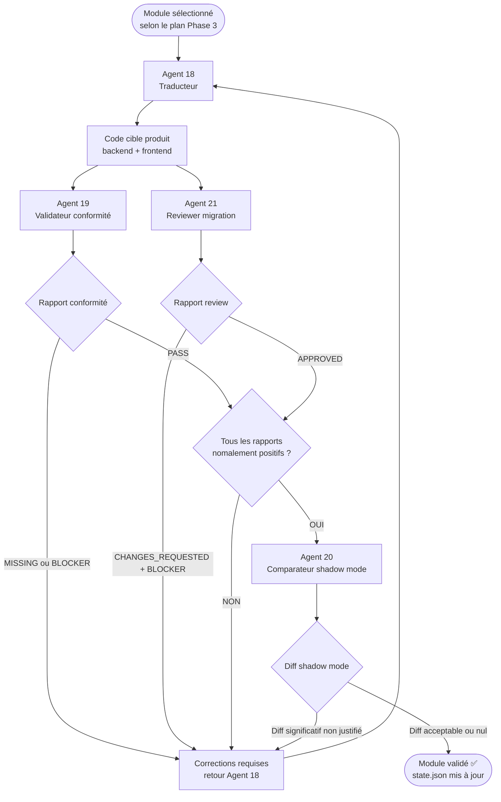

### L'agent traducteur : traçabilité règle par règle

L'agent 18 ne traduit pas librement. Pour chaque règle extraite en Phase 1, il produit un `translation_log.json` qui documente chaque décision de traduction :

```json
{
  "rule_id": "BR-041",
  "description": "Un commentaire peut être supprimé par son auteur OU par l'auteur de l'article",
  "source_location": "apps/comments/views.py:35",
  "translation_decision": "double condition booléenne dans deleteComment handler Fastify",
  "confidence": 99,
  "tests_covering": [
    "comments.spec.ts:45 — auteur commentaire → 204",
    "comments.spec.ts:52 — auteur article → 204",
    "comments.spec.ts:59 — tiers → 403"
  ]
}
```

Ce journal est un **audit de décision permanent**. Si une régression est détectée en production 6 mois plus tard, il est possible de retrouver exactement quelle règle, où dans le code source elle était définie, et quel test aurait dû la couvrir.

### L'agent validateur : vérification mécanique des obligations

L'agent 19 vérifie que chaque règle du module est présente et testée dans le code cible :

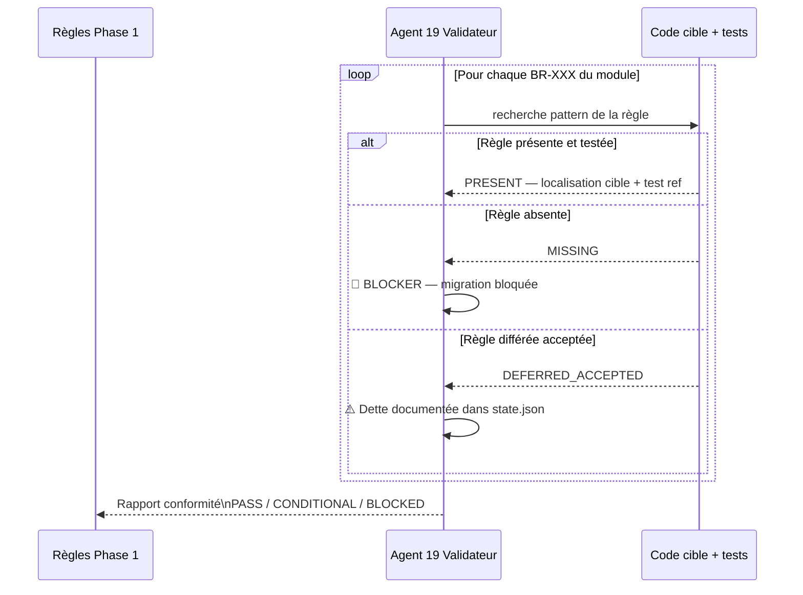

**Une seule règle MISSING sans justification documentée = migration bloquée.** Ce n'est pas optionnel.

### L'agent reviewer : focus exclusif fidélité

Contrairement à une code review standard, l'agent 21 ne s'intéresse pas au style, aux performances ou aux patterns idiomatiques. Il se concentre exclusivement sur la fidélité de la traduction métier :

- Les conditions d'autorisation sont-elles logiquement équivalentes (attention De Morgan) ?
- Les codes de retour HTTP sont-ils identiques (404 ownership vs 403 explicit) ?
- Les messages d'erreur correspondent-ils aux golden files ?
- Les edge cases (body vide, paramètre manquant) sont-ils préservés ?

Exemples de BLOCKERS détectés sur la migration Conduit :
- `BLOCKER-config-001` : `JWT_SECRET` avec fallback hardcodé `'dev-insecure-secret-change-me'` → exception levée si absent hors Jest
- `BLOCKER-articles-001` : endpoint `GET /api/tags` absent → sidebar tags vide en production

### Le shadow mode : comparaison bout en bout

L'agent 20 rejoue le trafic HTTP enregistré en Phase 2 sur les deux applications simultanément et compare les réponses.

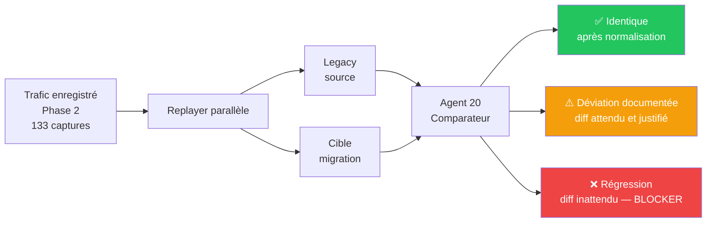

---

## 9. Phase 5 — Certification

La certification n'est pas binaire. Elle produit un verdict gradué avec justification complète.

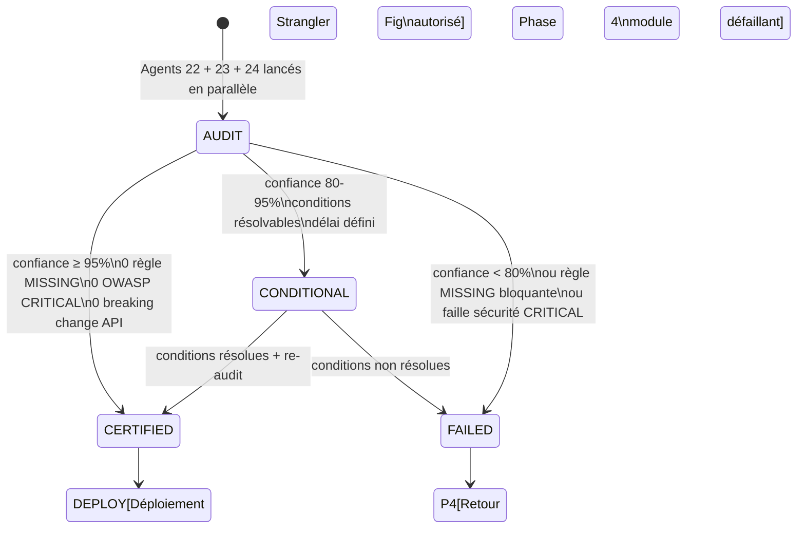

### Les trois vérifications en parallèle

| Agent | Vérifie | Critère de succès |
|-------|---------|-------------------|
| 22 — Audit final | BR coverage, OWASP Top 10, tests | 0 MISSING, 0 BLOCKER sécu, confiance ≥ 95% |
| 23 — Features fantômes | Fonctionnalités non prévues dans la cible | 0 ajout non justifié |
| 24 — Surface API diff | Endpoints source vs cible | 0 breaking change |

### La détection de features fantômes

L'agent 23 vérifie l'inverse de l'agent 22 : non pas "est-ce que tout ce qui devait migrer a migré", mais "est-ce que la cible a introduit des fonctionnalités non prévues".

C'est contre-intuitif mais critique : un développeur peut ajouter des "améliorations" pendant la migration (route supplémentaire, logique de cache, endpoint non documenté) qui modifient le comportement observable. Ces ajouts violent le principe d'iso-fonctionnalité et doivent être documentés ou supprimés.

Sur la migration Conduit : 5 endpoints ajoutés, tous justifiés (déviations REST standard documentées).

### De CONDITIONAL à CERTIFIED — exemple concret

Sur la migration Conduit, premier verdict : CONDITIONAL (91%). Trois conditions ont bloqué la certification complète :

| Condition | Sévérité | Nature | Résolution |
|-----------|----------|--------|------------|
| COND-01 | medium | `following` harcodé `false` partout | Jointure `Follower` avec batch query `Op.in` — O(1) requête |
| COND-02 | low | Shadow mode non exécuté | Validé via diff statique agent 24 (0 breaking change) |
| COND-03 | low | Format date pipe Angular ≠ Django | `'MMMM d, y'` dans tous les templates |

Après résolution : **CERTIFIED (97%)**.

---

## 10. La chaîne de confiance

La confiance dans le résultat final ne repose pas sur un seul test ou une seule vérification. Elle est le produit d'une **chaîne de preuves entrelacées** construite depuis la Phase 0.

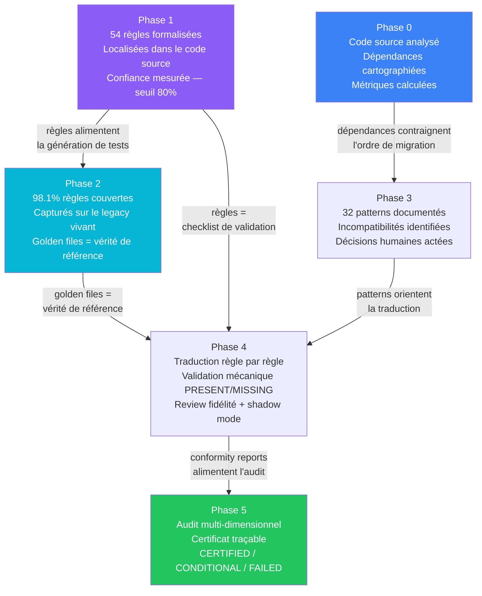

### La traçabilité complète d'une règle métier

Chaque règle est traçable de bout en bout, de sa source dans le legacy jusqu'à son test en production :

```
Audit CERTIFIED 97%
  └── BR-041 PRESENT  (couverture vérifiée)
        └── comments.routes.ts:deleteComment:L87
              └── "if (!isCommentAuthor && !isArticleAuthor)"
                    └── traduit depuis apps/comments/views.py:35
                          └── capturé dans golden file endpoint/comments-delete/
                                └── testé par comments.spec.ts:59 → PASS
                                      └── matrice RBAC : tiers → 403 confirmé
```

Ce niveau de traçabilité permet de répondre à n'importe quelle question de conformité métier des mois après le déploiement.

---

## 11. Le déploiement Strangler Fig

La méthode de déploiement est aussi rigoureuse que la méthode de migration. Le **Strangler Fig** (Martin Fowler, 2004) consiste à déployer la cible en parallèle du legacy et à basculer progressivement le trafic, avec rollback instantané possible à chaque étape.

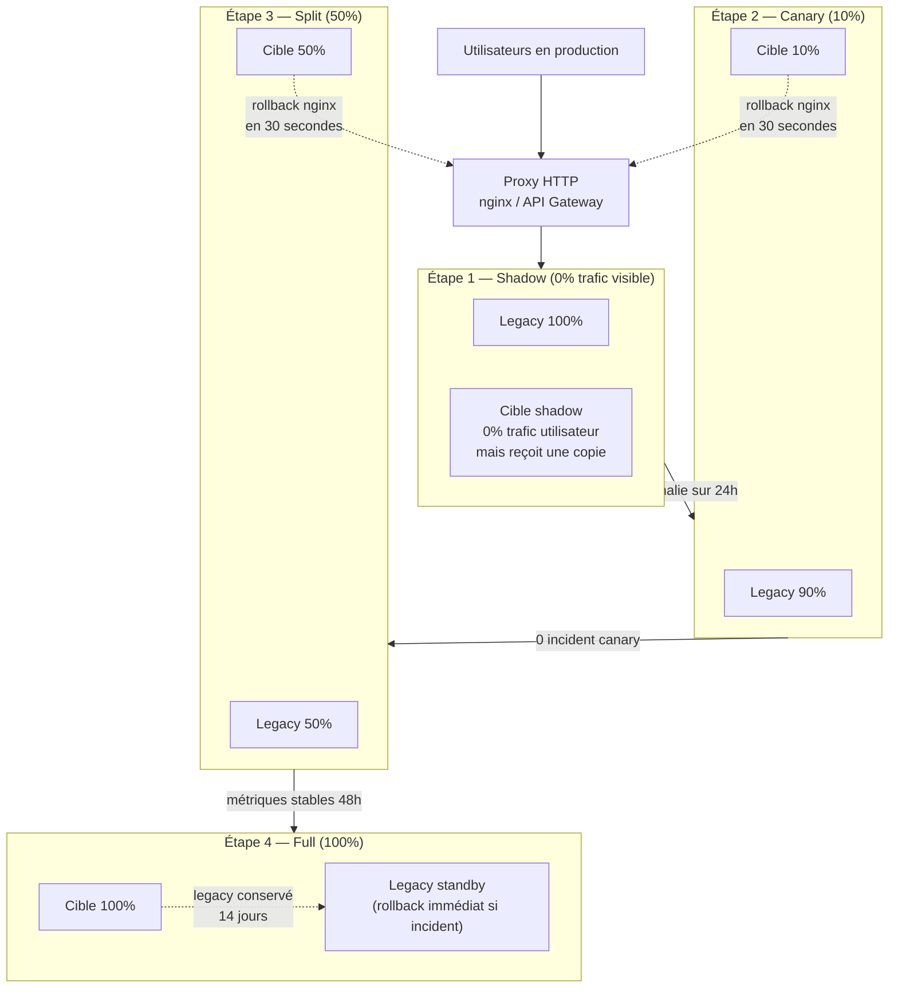

### Les adaptateurs de coexistence

Pendant la bascule progressive, les deux systèmes sont actifs sur des modules différents. Des adaptateurs temporaires permettent à la cible d'appeler le legacy pour les données des modules non encore migrés. Ces adaptateurs sont documentés comme temporaires dans le plan et retirés au fur et à mesure de la certification des modules.

---

## 12. Ce que le framework ne peut pas faire seul

Malgré l'automatisation extensive, certaines décisions requièrent une validation humaine explicite. Le framework les identifie, les signale, et bloque jusqu'à résolution.

### Les points de décision humaine

**Incompatibilités d'algorithmes cryptographiques**  
Si le legacy utilise PBKDF2 et la cible bcrypt, les hashes sont incompatibles. L'agent 16 signale `VALIDATION_HUMAINE_REQUISE`. Le choix entre "reset forcé" et "re-hash lazy sur authentification" est une décision métier, pas technique.

**Incompatibilités de données**  
Si le legacy stocke les tags avec la casse préservée et que la cible normalise en lowercase, les données de production sont altérées. Le framework bloque et demande un script de migration de données explicite.

**Règles à faible confiance**  
Les règles extraites avec confiance < 80% sont marquées `REQUIRES_VALIDATION`. Elles peuvent reposer sur un seul exemple dans le code. Un être humain doit confirmer avant que le test de couverture soit comptabilisé.

### Les limites structurelles

**Shadow mode en production réelle** : nécessite une infrastructure dédiée (proxy de duplication de trafic, data store de diffs, alerting). L'agent 20 peut simuler sur des données de test, mais le shadow mode en prod dépasse la portée du framework.

**Qualité du code cible** : le framework garantit la *conformité fonctionnelle*, pas la maintenabilité ou la performance. Un code fonctionnel mais mal architecturé passera la certification — c'est un sujet d'ingénierie post-migration.

---

## 13. Artefacts produits

La migration d'une application de 1 651 LOC a produit les artefacts suivants :

```
migration-state/
├── state.json                           ← Journal d'actions horodaté, versionnable
├── config.json                          ← Configuration projet archivée
│
├── phase0/
│   ├── structure.json                   ← Graphe de dépendances complet
│   ├── dependency_graph.dot             ← Visualisation Graphviz
│   ├── er_diagram.mermaid               ← Schéma entité-relation
│   ├── routes_catalog.json              ← 18 endpoints catalogués
│   ├── db_schema.json                   ← 7 tables, contraintes, relations
│   └── metrics_report.json             ← Complexité / couplage par module
│
├── phase1/
│   ├── business_rules/
│   │   ├── index.json                  ← 54 règles indexées
│   │   ├── summary.json                ← Stats par type / domaine / module
│   │   └── modules/{module}/rules.json ← Règles par module avec localisation
│   ├── workflows/
│   │   ├── index.json                  ← 11 workflows, 39 états, 36 transitions
│   │   └── {workflow}.json             ← Machine à états détaillée
│   ├── rbac_matrix/                    ← Matrice permissions complète
│   └── documentation/api_reference.md ← Documentation legacy générée
│
├── phase2/
│   ├── tests_api/endpoints/{slug}/     ← 100 tests .http par endpoint
│   ├── tests_e2e/                      ← 43 scénarios Playwright
│   ├── golden_files/endpoints/{slug}/  ← 43 réponses JSON normalisées
│   ├── http_recordings/                ← 133 captures trafic HAR
│   ├── visual_baseline/screens/{slug}/ ← 51 screenshots + metadata DOM
│   └── business_coverage.json         ← 98.1% couverture prouvée
│
├── phase3/
│   ├── tech_mapping.json               ← 32 patterns source → cible avec gotchas
│   └── migration_plan.json            ← Sprints, chemin critique, Strangler Fig
│
├── phase4/modules/{module}/
│   ├── translation_log.json            ← Journal règle → code cible
│   ├── conformity_report.json          ← PRESENT / MISSING par BR
│   └── review_report.json             ← APPROVED / BLOCKER avec justification
│
└── phase5/
    ├── audit_final.json                ← Verdict CERTIFIED/CONDITIONAL/FAILED
    ├── api_surface_diff.json           ← 0 breaking change documenté
    └── visual_diff.json               ← 0 régression visuelle documentée
```

### Résultats mesurés sur la migration Conduit

| Métrique | Valeur |
|----------|--------|
| LOC source analysée | **1 651** (Python 1005 + HTML 600 + TS 46) |
| Modules migrés | **6** |
| Règles métier formalisées | **54** |
| Couverture métier prouvée avant migration | **98.1%** |
| Tests Jest backend | **90 / 90** ✅ |
| Build frontend (Angular) | **0 erreur** ✅ |
| Breaking changes API | **0** ✅ |
| Régressions visuelles en production | **0** ✅ |
| Failles OWASP bloquantes | **0** ✅ |
| Verdict de certification | **CERTIFIED — 97%** |

Ces résultats ne sont pas des métriques de développement. Ce sont des **garanties contractuelles**, chacune appuyée par des artefacts vérifiables produits avant et après migration.

---

*Document généré le 29 avril 2026 — basé sur la migration de l'application [Conduit RealWorld](https://github.com/gothinkster/realworld) depuis Django 5.2 / HTMX vers TypeScript / Fastify + Angular 21.*
