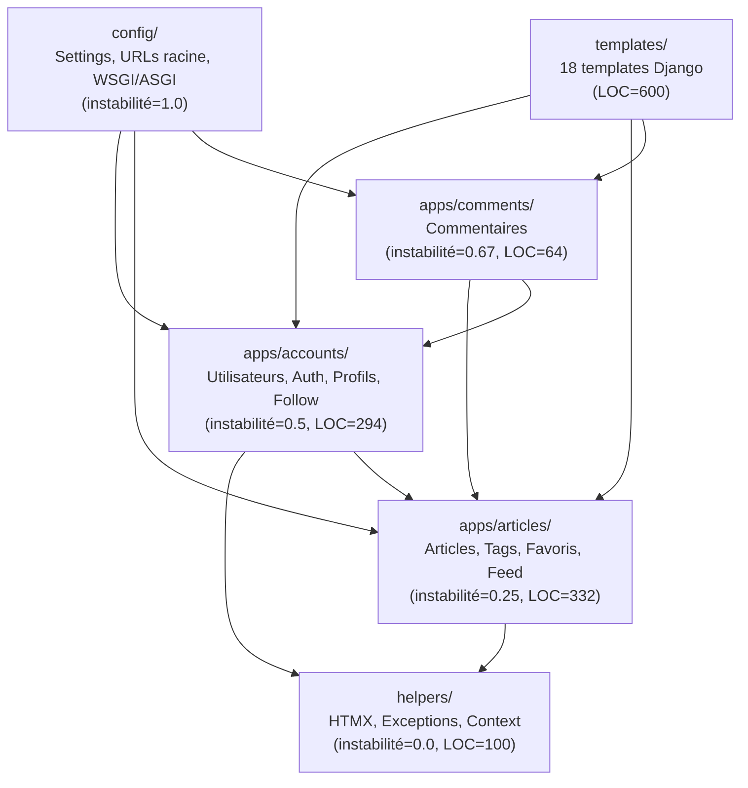
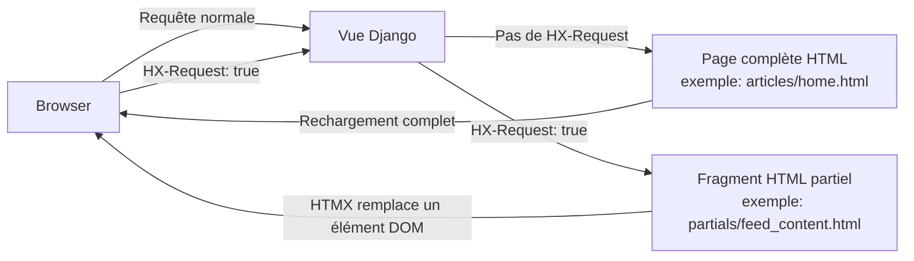

# Architecture — Vue Technique

[← Retour à l'index](./index.md)

---

## Structure des modules

L'application est un **monolithe Django SSR (Server-Side Rendering)** avec des interactions partielles HTMX. Il n'y a pas de SPA ni d'API REST séparée.



### Description des modules

| Module | Rôle | LOC | Effort migration | Complexité max |
|---|---|---|---|---|
| `helpers/` | Utilitaires transverses (HTMX, erreurs, contexte) | 100 | Low | CC=4 |
| `apps/accounts/` | Modèle User, Auth, Follow, Profil | 294 | **High** | CC=6 |
| `apps/articles/` | CRUD articles, Feed, Tags, Favoris | 332 | **High** | CC=6 |
| `apps/comments/` | Commentaires sur articles | 64 | Low | CC=4 |
| `config/` | Configuration Django (settings, urls, wsgi) | 215 | Medium | — |
| `templates/` | 18 templates HTML + 8 partials HTMX | 600 | **Very High** | 18 composants Angular |

---

## Flux de rendu : Django + HTMX

Le rendu suit deux chemins selon la présence du header `HX-Request: true` ([BR-001](./business_rules_index.md#br-001)) :



### Les 8 interactions HTMX documentées

| Déclencheur | Partial retourné | Description |
|---|---|---|
| Navigation fil d'actualité (`/?feed=…`) | `partials/feed_content.html` | Changement d'onglet sans rechargement |
| Filtrage par tag (`/tag/<tag>`) | `partials/feed_content.html` | Affichage des articles du tag |
| Toggle favori (`POST /article/<slug>/favorite`) | `partials/favorite_button.html` | Mise à jour du bouton favori |
| Toggle follow (`POST /profile/<username>/follow`) | `partials/follow_button.html` | Mise à jour du bouton follow |
| Créer commentaire (`POST /article/<slug>/comment`) | `partials/comment_list.html` | Rafraîchissement liste commentaires |
| Supprimer commentaire | `partials/comment_list.html` | Rafraîchissement liste commentaires |
| Navigation profil (`/profile/<username>`) | Sélection hx-select sur `.profile-page` | Transition sans rechargement |
| Navigation fil global/following | `partials/feed_content.html` | Changement d'onglet |

> **Pour la migration** : chaque partial HTMX devient un **composant Angular** autonome. Les requêtes HTMX seront remplacées par des appels API REST + data binding Angular.

---

## Pile technique source

| Composant | Technologie |
|---|---|
| Langage | Python 3.x |
| Framework web | Django 5.2 |
| Rendu | Server-Side Rendering (SSR) + HTMX (fragments partiels) |
| ORM | Django ORM |
| Base de données | SQLite (local/test) / PostgreSQL (production) |
| Authentification | Sessions Django + CsrfViewMiddleware |
| Tags | django-taggit (GenericForeignKey) |
| Markdown | `markdown` lib + `nh3` (sanitisation XSS) |
| Tests E2E | Playwright (spec RealWorld) |
| Gestion des paquets | uv |

## Pile technique cible

| Composant | Technologie |
|---|---|
| Langage | TypeScript |
| Frontend | Angular |
| Backend | Fastify |
| ORM | Sequelize |
| Base de données | PostgreSQL |
| Authentification | JWT (à implémenter) |
| Tests | Jest |

---

## Ordre de migration recommandé

Basé sur l'instabilité des modules (modules stables en premier) :

```
1. helpers        → instabilité 0.0, base utilitaire
2. tests_e2e      → configuration Playwright
3. config         → settings & routing
4. articles       → module central (instabilité 0.25)
5. accounts       → dépend de articles pour profiles
6. comments       → dépend de articles + accounts
7. templates      → composants Angular (le plus complexe)
```

> ⚠️ **articles doit être migré avant accounts et comments** car accounts dépend d'`articles.models` dans `profile_view`.

---

## Code mort identifié

| Fichier | Élément | Type | Note |
|---|---|---|---|
| `helpers/exceptions.py` | `get_or_404()` | Fonction | Définie mais jamais appelée (les vues utilisent `get_object_or_404` de Django) |
| `helpers/exceptions.py` | `ResourceNotFound` | Classe | Définie mais jamais utilisée |
| `helpers/exceptions.py` | `get_or_404` (import) | Référence | Importé nulle part |

> **Pour la migration** : ne pas migrer ces éléments morts.

---

*[← Index](./index.md) | [Modèle de données →](./data_model.md)*
