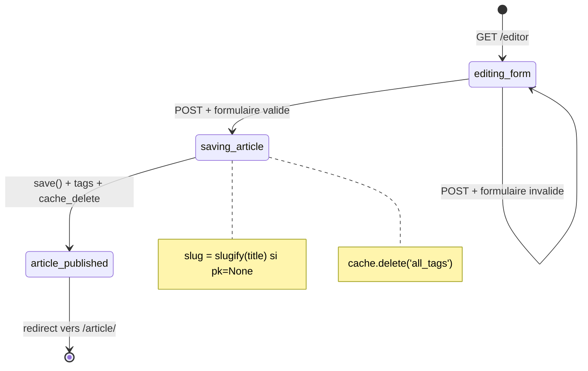
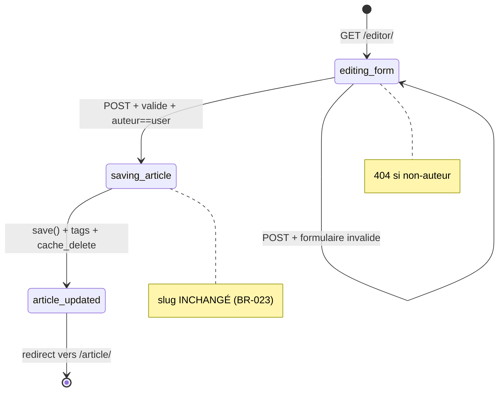
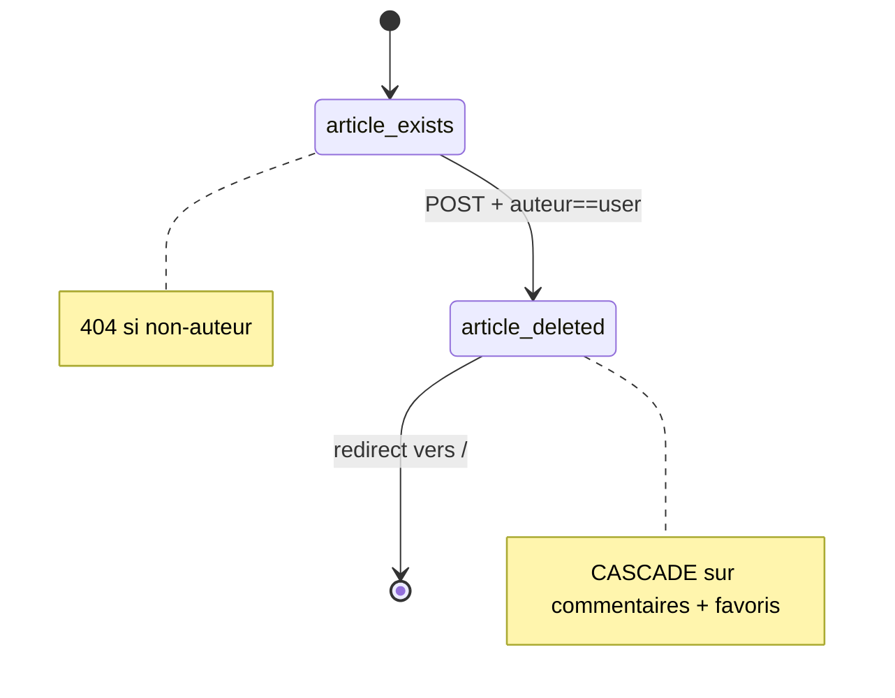
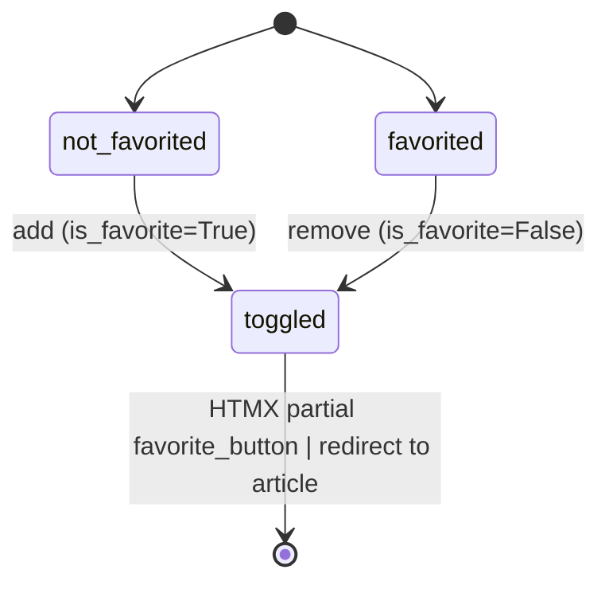
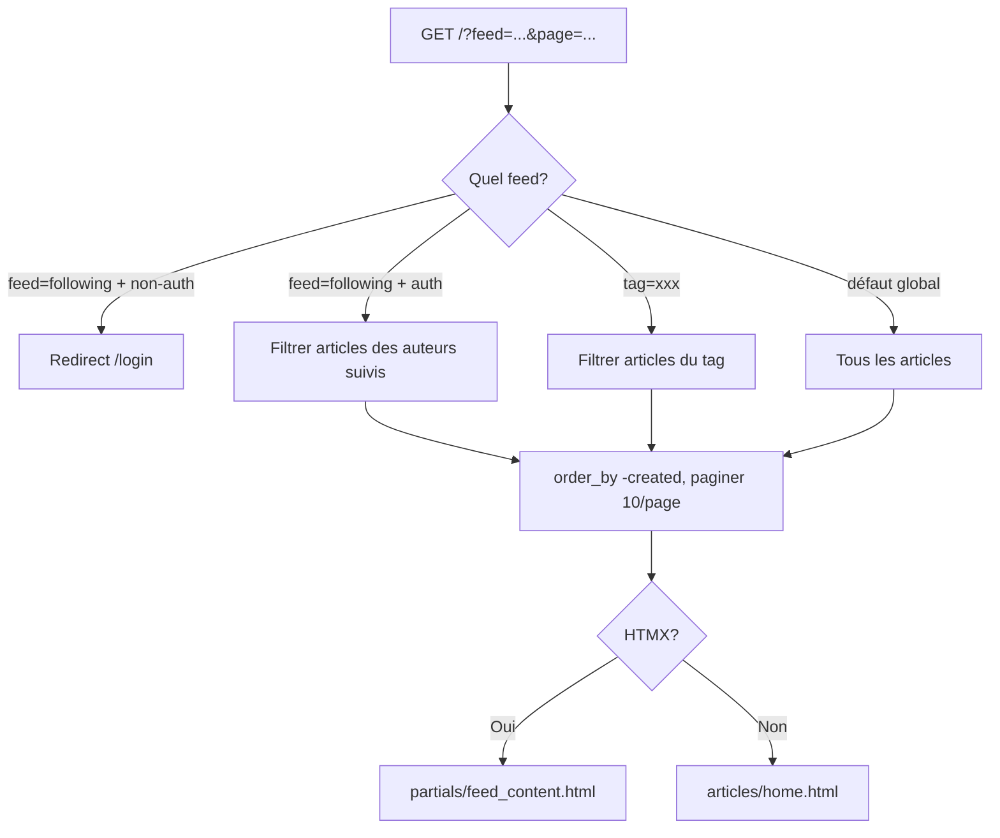
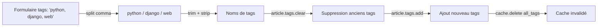

# Domaine : Articles

[← Retour à l'index](../index.md)

---

## Vue d'ensemble

Le domaine articles est le **cœur de l'application**. Il couvre la publication, l'édition, la suppression d'articles, le fil d'actualité (feed), les tags, et les favoris. C'est le module avec le plus de dépendances (instabilité 0.25 → beaucoup d'autres modules en dépendent).

---

## Modules concernés

| Module | Fichier principal | Rôle |
|---|---|---|
| `articles` | `apps/articles/views.py` | CRUD, feed, favoris |
| `articles` | `apps/articles/models.py` | Article, ArticleQuerySet, ArticleManager |
| `articles` | `apps/articles/forms.py` | ArticleForm |
| `articles` | `apps/articles/templatetags/markdown_filter.py` | Rendu Markdown → HTML |
| `helpers` | `helpers/htmx.py` | Détection requêtes HTMX |

---

## Règles métier associées

| ID | Résumé |
|---|---|
| [BR-022](../business_rules_index.md#br-022) | Titre obligatoire unique max 150 chars ; summary et content optionnels |
| [BR-023](../business_rules_index.md#br-023) | Slug généré au save initial depuis slugify(title), jamais régénéré |
| [BR-024](../business_rules_index.md#br-024) | `created` = auto_now_add, indexé ; `updated` = auto_now |
| [BR-025](../business_rules_index.md#br-025) | `num_favorites` et `is_favorite` calculés par annotation SQL |
| [BR-026](../business_rules_index.md#br-026) | 3 onglets: global / following (auth) / tag |
| [BR-027](../business_rules_index.md#br-027) | Tags cachés 5 min ; cache invalidé à la sauvegarde d'article |
| [BR-028](../business_rules_index.md#br-028) | Pagination: 10 articles/page, triés par date décroissante |
| [BR-029](../business_rules_index.md#br-029) | HTMX → partial `feed_content.html` ; sinon page complète |
| [BR-030](../business_rules_index.md#br-030) | Article inexistant → 404 dédié + slug en contexte |
| [BR-031](../business_rules_index.md#br-031) | Mapping form→modèle: `description→summary`, `body→content` |
| [BR-032](../business_rules_index.md#br-032) | Tags: clear puis re-add à la sauvegarde |
| [BR-033](../business_rules_index.md#br-033) | Création: auth requise, auteur = request.user |
| [BR-034](../business_rules_index.md#br-034) | Édition: auth + auteur. Non-propriétaire → 404 (pas 403) |
| [BR-035](../business_rules_index.md#br-035) | Suppression: auth + auteur + POST. Cascade sur commentaires |
| [BR-036](../business_rules_index.md#br-036) | Favori = toggle (add/remove). Auteur peut favoriser son propre article |
| [BR-037](../business_rules_index.md#br-037) | Markdown → HTML sanitisé par nh3 (anti-XSS) |
| [BR-038](../business_rules_index.md#br-038) | Tags optionnels via django-taggit |

---

## Workflows

### WF-006 — Création d'article

**Étapes clés :**
1. Formulaire vide affiché
2. Soumission : titre (obligatoire), description, body (Markdown), tags (virgule-séparés)
3. Création de l'objet `Article(author=request.user)`
4. Slug généré automatiquement : `slugify(title)` lors du premier `save()`
5. Tags : `article.tags.clear()` puis `article.tags.add(tag)` pour chaque tag
6. `cache.delete('all_tags')` — invalide le cache de la liste des tags
7. Redirect vers `/article/<slug>`

---

### WF-007 — Édition d'article

**Point critique** : Le slug n'est **jamais régénéré** lors d'une modification, même si le titre change ([BR-023](../business_rules_index.md#br-023)).

---

### WF-008 — Suppression d'article

---

### WF-009 — Toggle favori

---

## Fonctionnement du fil d'actualité (Feed)

### Annotation SQL pour les favoris

Pour chaque article du feed, deux valeurs sont calculées en une seule requête ([BR-025](../business_rules_index.md#br-025)) :

| Champ | Calcul | Disponible pour |
|---|---|---|
| `num_favorites` | `COUNT(article.favorites)` | Tous les utilisateurs |
| `is_favorite` | `EXISTS(user IN article.favorites)` | Authentifiés seulement |

---

## Mapping formulaire ↔ modèle

> Spécificité du spec RealWorld — **ne pas se tromper dans la migration** !

| Champ formulaire | Champ modèle | Requis | Contrainte |
|---|---|---|---|
| `title` | `article.title` | **Oui** | max 150, unique |
| `description` | `article.summary` | Non | défaut `""` |
| `body` | `article.content` | Non | Markdown |
| `tags` | `article.tags` | Non | chaîne virgule-séparée |

---

## Tables de base de données concernées

| Table | Opérations | Description |
|---|---|---|
| `articles_article` | READ, WRITE, DELETE | CRUD des articles |
| `articles_article_favorites` | READ, WRITE | Toggle favoris |
| `accounts_user` | READ | Auteur, is_following |
| `accounts_user_followers` | READ | Calcul du fil "following" |
| `taggit_tag` | READ, WRITE | Tags (cache 5 min) |
| `taggit_taggeditem` | READ, WRITE, DELETE | Jointure tags-articles |

---

## Gestion des tags

> **Bug potentiel identifié** : lors de la **suppression d'un article**, le cache `all_tags` n'est pas invalidé. Des tags orphelins peuvent rester visibles dans la sidebar jusqu'à expiration du cache (5 minutes). Voir [attention_points.md](../attention_points.md).

---

## Routes concernées

| Route | Auth ? | Lien |
|---|---|---|
| GET / | Non | [Référence API](../api_reference.md) |
| GET /tag/<tag> | Non | [Référence API](../api_reference.md) |
| GET /article/<slug> | Non | [Référence API](../api_reference.md) |
| GET /editor | **Oui** | [Référence API](../api_reference.md) |
| POST /editor | **Oui** | [Référence API](../api_reference.md) |
| GET /editor/<slug> | **Oui** | [Référence API](../api_reference.md) |
| POST /editor/<slug> | **Oui** | [Référence API](../api_reference.md) |
| POST /article/<slug>/delete | **Oui** | [Référence API](../api_reference.md) |
| POST /article/<slug>/favorite | **Oui** | [Référence API](../api_reference.md) |

---

## Notes pour la migration vers Angular/Fastify

1. **QuerySet personnalisé** → Sequelize : implémenter `ArticleQuerySet.with_favorites()` comme un scope ou méthode statique avec `COUNT` + `EXISTS` subquery.
2. **django-taggit** → Sequelize : remplacer par une table `article_tags` directe avec relation M2M simple (sans GenericForeignKey).
3. **Slug** : conserver la logique de génération unique à la création (`slugify` équivalent TypeScript). **Ne jamais régénérer le slug à l'édition**.
4. **Cache tags** : implémenter avec Redis ou un cache in-memory. Durée : 5 minutes. Invalider sur `article.save()`, **mais aussi sur `article.delete()`** (correction du bug legacy).
5. **Markdown sanitisé** : côté Angular, utiliser `marked` + `DOMPurify` pour reproduire `markdown + nh3` ([BR-037](../business_rules_index.md#br-037)).
6. **404 vs 403** : non-propriétaire sur edit/delete → **retourner 404** (pas 403, intentionnel, [BR-034](../business_rules_index.md#br-034)).
7. **Pagination** : 10 articles/page, tri `ORDER BY created DESC`.

---

*[← Authentification](./authentication.md) | [Commentaires →](./comments.md)*
