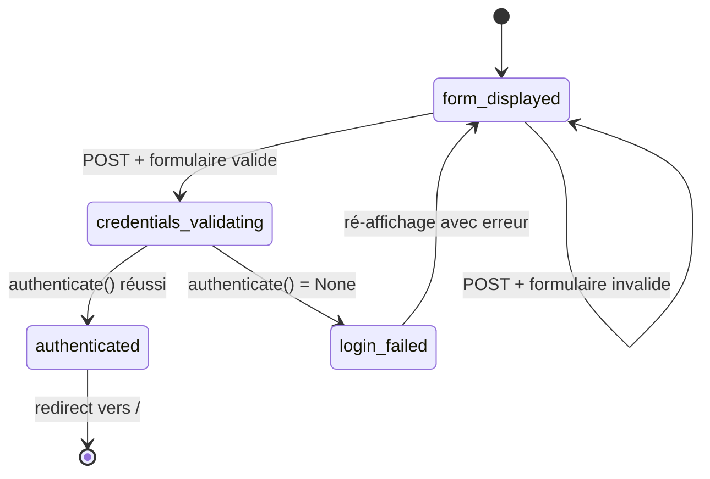
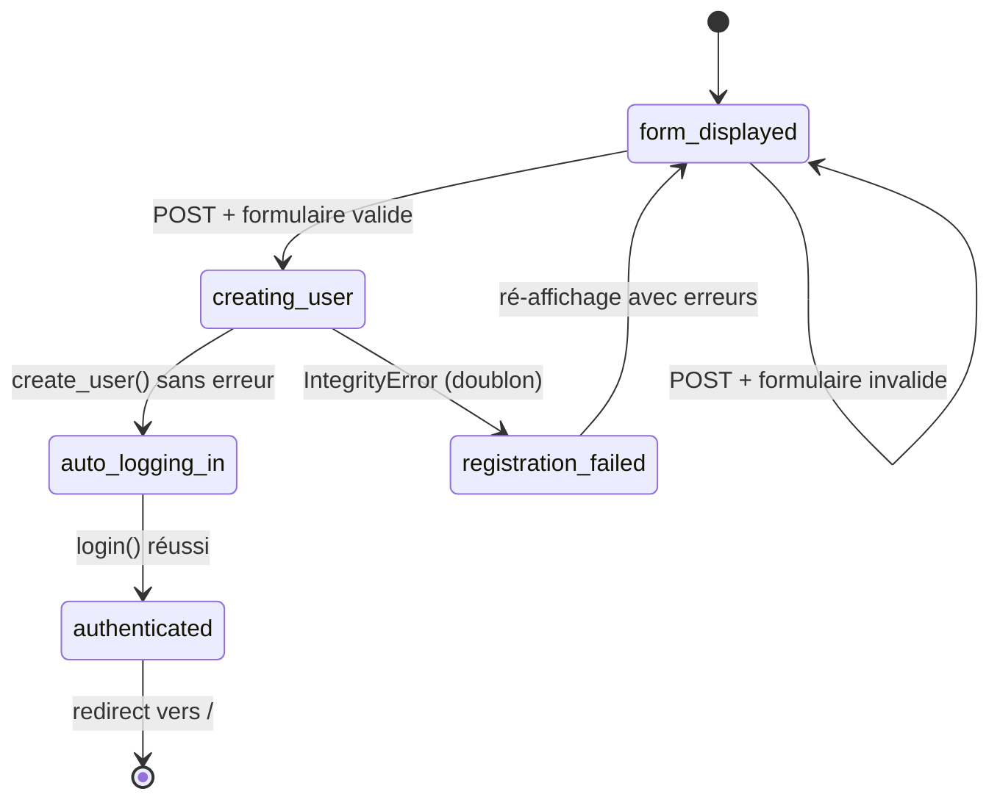
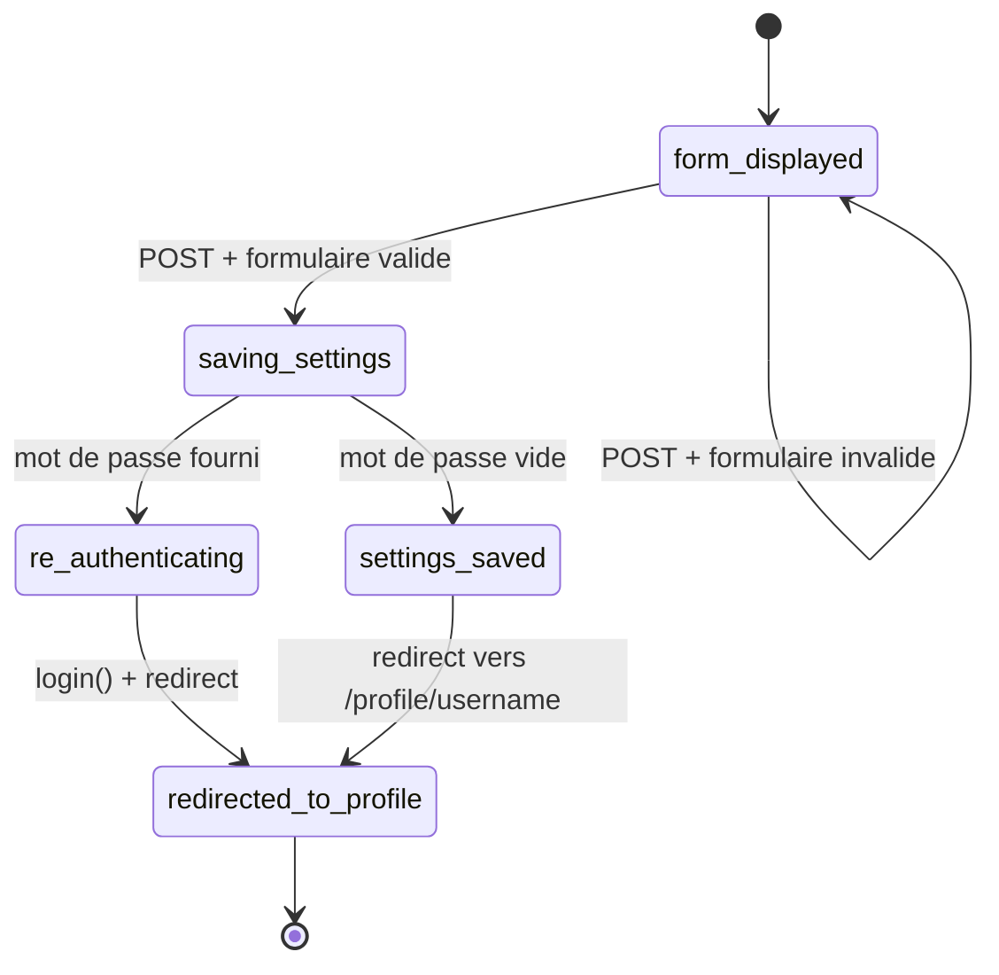
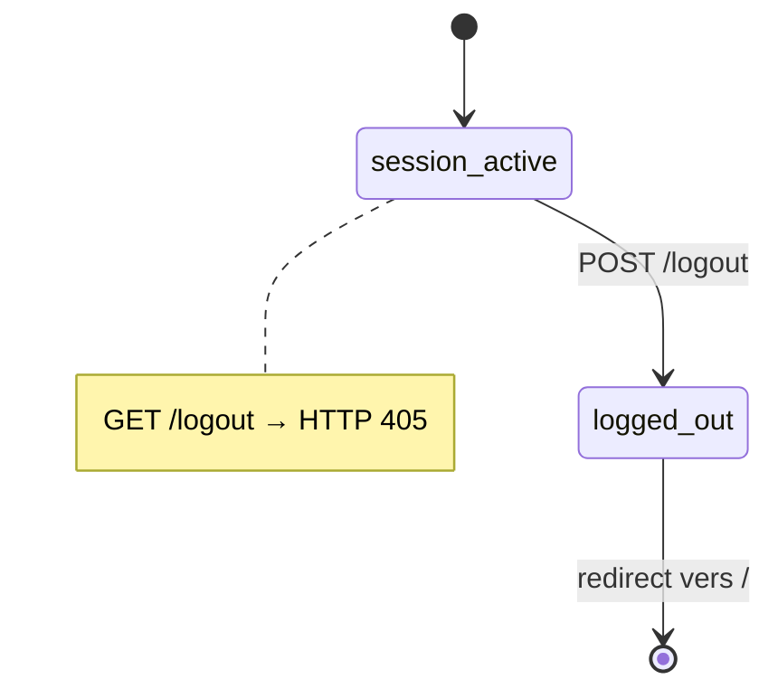

# Domaine : Authentification

[← Retour à l'index](../index.md)

---

## Vue d'ensemble

Le domaine authentification couvre l'inscription, la connexion, la gestion des paramètres du compte et la déconnexion. L'authentification est basée sur les **sessions Django** (cookie) avec l'**email comme identifiant principal**.

---

## Modules concernés

| Module | Fichier principal | Rôle |
|---|---|---|
| `accounts` | `apps/accounts/views.py` | Login, Register, Settings, Logout |
| `accounts` | `apps/accounts/models.py` | Modèle User (email comme username) |
| `accounts` | `apps/accounts/forms.py` | LoginForm, RegisterForm, SettingsForm |
| `config` | `config/settings.py` | LOGIN_URL, AUTH_PASSWORD_VALIDATORS |
| `helpers` | `helpers/exceptions.py` | Parsing des erreurs d'unicité |

---

## Règles métier associées

| ID | Résumé |
|---|---|
| [BR-004](../business_rules_index.md#br-004) | Validateurs de mot de passe **non appliqués** (comportement voulu) |
| [BR-005](../business_rules_index.md#br-005) | Redirect vers `/login` pour les routes protégées |
| [BR-007](../business_rules_index.md#br-007) | Email = identifiant, username = nom d'affichage |
| [BR-008](../business_rules_index.md#br-008) | Pas de `first_name`/`last_name` |
| [BR-009](../business_rules_index.md#br-009) | `bio` = texte, `image` = URL externe |
| [BR-011](../business_rules_index.md#br-011) | Login email+password, message générique en cas d'échec |
| [BR-012](../business_rules_index.md#br-012) | Redirect vers `/` après login |
| [BR-013](../business_rules_index.md#br-013) | Inscription: messages d'erreur spécifiques par champ |
| [BR-014](../business_rules_index.md#br-014) | Auto-login après inscription réussie |
| [BR-015](../business_rules_index.md#br-015) | Settings: re-login si mot de passe modifié |
| [BR-016](../business_rules_index.md#br-016) | Logout = POST uniquement |
| [BR-020](../business_rules_index.md#br-020) | Settings + Follow protégés par auth |

---

## Workflows

### WF-001 — Connexion (Login)

**Étapes clés :**
1. Utilisateur saisit email + password
2. `authenticate(email=..., password=...)` est appelé
3. Si succès : `login(request, user)` → session créée → redirect `/`
4. Si échec : message générique `"Invalid email or password."` (pas de distinction)

---

### WF-002 — Inscription (Register)

**Étapes clés :**
1. Saisie username + email + password
2. Création dans `transaction.atomic()` (`User.objects.create_user(...)`)
3. Si `IntegrityError` → parsing du champ en erreur ([BR-002](../business_rules_index.md#br-002)) → message spécifique
4. Si succès → auto-login + redirect `/`

> **Important** : aucune validation de complexité de mot de passe ([BR-004](../business_rules_index.md#br-004)).

---

### WF-003 — Paramètres utilisateur (Settings)

**Étapes clés :**
1. Formulaire pré-rempli avec les données actuelles
2. Modification de `image`, `username`, `bio`, `email`
3. Si `password` fourni : `user.set_password(password)` + re-login (pour maintenir la session)
4. Redirect vers `/profile/<username>`

---

### WF-004 — Déconnexion (Logout)

**Attention** : `/logout` n'a pas de `@login_required`. Un utilisateur non connecté peut appeler l'endpoint (no-op). Voir [Points d'attention](../attention_points.md#anomalie-1).

---

## Tables de base de données concernées

| Table | Opérations | Description |
|---|---|---|
| `accounts_user` | READ, WRITE | Lecture lors de l'auth, écriture à l'inscription et settings |
| `accounts_user_followers` | READ | Vérification is_following dans le contexte profil |

---

## Routes concernées

| Route | Auth ? | Lien |
|---|---|---|
| GET /login | Non | [Référence API](../api_reference.md#get-login) |
| POST /login | Non | [Référence API](../api_reference.md#post-login) |
| GET /register | Non | [Référence API](../api_reference.md#get-register) |
| POST /register | Non | [Référence API](../api_reference.md#post-register) |
| GET /settings | **Oui** | [Référence API](../api_reference.md#get-settings) |
| POST /settings | **Oui** | [Référence API](../api_reference.md#post-settings) |
| POST /logout | Non ⚠️ | [Référence API](../api_reference.md#post-logout) |

---

## Mécanismes de sécurité

| Mécanisme | Détail |
|---|---|
| Sessions | Cookie-based Django sessions (`SessionMiddleware`) |
| CSRF | `CsrfViewMiddleware` global + `` dans les formulaires |
| Authentification | `ModelBackend` avec `USERNAME_FIELD='email'` |
| Redirect si non-connecté | `LOGIN_URL = '/login'` |
| Pas de JWT | Pas d'API REST — tout est session-based |
| Pas d'OAuth | Pas de SSO |

---

## Notes pour la migration vers Angular/Fastify

1. **Sessions → JWT** : Remplacer les sessions Django par des tokens JWT dans les headers `Authorization: Bearer <token>`.
2. **Email = username** : Sequelize `User` model avec `email` unique + `username` unique séparés.
3. **Auto-login après inscription** : Le backend doit retourner un JWT immédiatement après création du compte.
4. **Re-login après changement de mot de passe** : Invalider l'ancien token, émettre un nouveau JWT.
5. **Aucune validation de complexité de mot de passe** ([BR-004](../business_rules_index.md#br-004)).
6. **Message d'erreur générique** pour login échoué (pas de distinction email/password).

---

*[← Index](../index.md) | [Articles →](./articles.md)*
