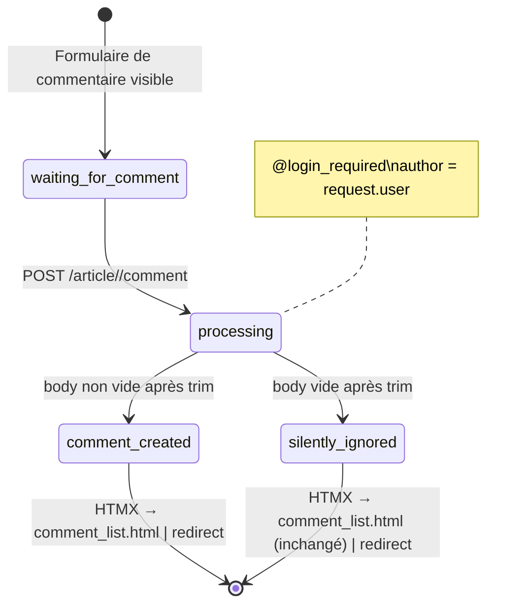
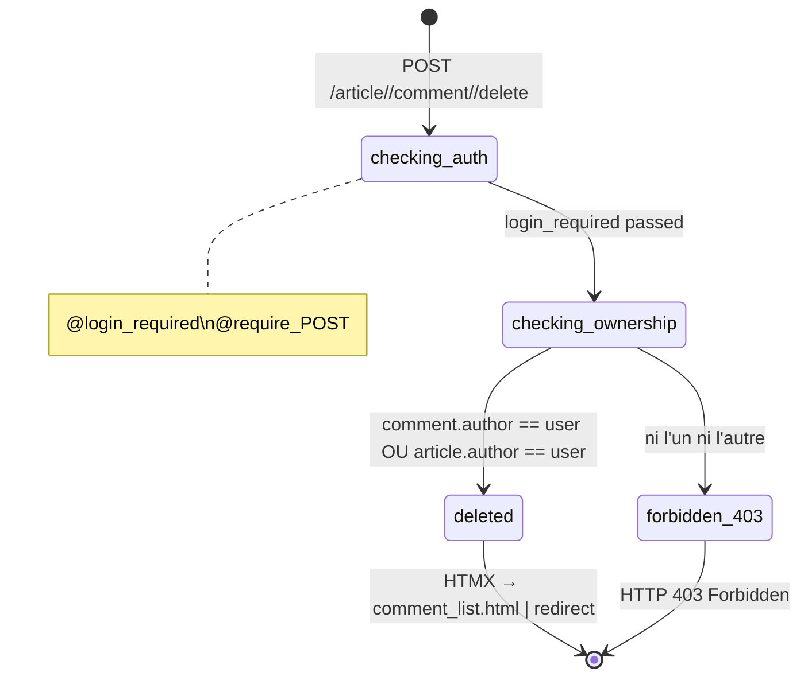
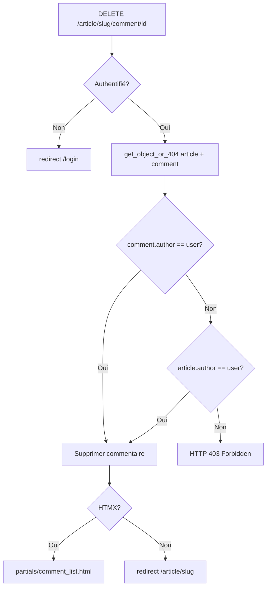

# Domaine : Commentaires

[← Retour à l'index](../index.md)

---

## Vue d'ensemble

Le domaine commentaires gère la création et suppression de commentaires sur les articles. C'est le module le plus simple de l'application (64 LOC, 2 vues). Sa particularité principale est la **logique d'autorisation duale** à la suppression.

---

## Modules concernés

| Module | Fichier | Rôle |
|---|---|---|
| `comments` | `apps/comments/views.py` | Créer et supprimer des commentaires |
| `comments` | `apps/comments/models.py` | Modèle Comment |
| `articles` | `apps/articles/views.py` | Lecture des commentaires dans `article_detail_view` |
| `helpers` | `helpers/htmx.py` | Détection requêtes HTMX |

---

## Règles métier associées

| ID | Résumé |
|---|---|
| [BR-039](../business_rules_index.md#br-039) | Body trimmé, si vide → pas de création (silencieux) |
| [BR-040](../business_rules_index.md#br-040) | Création = auth + POST. Auteur = request.user |
| [BR-041](../business_rules_index.md#br-041) | **Suppression = auteur commentaire OU auteur article → sinon 403** |
| [BR-042](../business_rules_index.md#br-042) | HTMX → `partials/comment_list.html` ; sinon redirect |
| [BR-043](../business_rules_index.md#br-043) | FK CASCADE : suppression article ou user → suppression commentaires |
| [BR-044](../business_rules_index.md#br-044) | Suppression: commentaire doit appartenir à l'article du slug → sinon 404 |

---

## Workflows

### WF-010 — Créer un commentaire



**Comportement important** : Un body vide (ou uniquement composé d'espaces) ne génère **aucune erreur**. La liste de commentaires est simplement rechargée sans nouveau commentaire.

---

### WF-011 — Supprimer un commentaire



**Point critique** : C'est le **seul endpoint** de l'application qui retourne un **HTTP 403 Forbidden** (tous les autres retournent 404 pour les cas non autorisés ou n'autorisent pas du tout l'accès).

---

## Logique d'autorisation à la suppression



> L'auteur de l'article peut supprimer **n'importe quel commentaire** sur ses propres articles (modération).

---

## Modèle de données

| Colonne | Type | Description |
|---|---|---|
| `id` | bigint PK | — |
| `content` | text | Corps du commentaire (trimmé) |
| `created` | datetime auto+index | Date de création |
| `updated` | datetime auto | Dernière modification |
| `article_id` | FK → articles_article CASCADE | Article parent |
| `author_id` | FK → accounts_user CASCADE | Auteur |

**Cascade** :
- `article.delete()` → tous les commentaires de l'article sont supprimés
- `user.delete()` → tous les commentaires de l'utilisateur sont supprimés

---

## Interface utilisateur

**Pour les authentifiés** : formulaire de commentaire visible sous l'article.

**Pour les non-authentifiés** : message `"Sign in or sign up to add comments on this article."` avec lien vers `/register` ([BR-053](../business_rules_index.md#br-053)).

**Bouton de suppression** : visible uniquement si l'utilisateur est l'auteur du commentaire. L'auteur de l'article peut voir le bouton sur tous les commentaires (à vérifier dans les templates).

---

## Tables de base de données concernées

| Table | Opérations | Description |
|---|---|---|
| `comments_comment` | READ, WRITE, DELETE | CRUD des commentaires |
| `articles_article` | READ | Vérification d'existence et d'auteur |
| `accounts_user` | READ | Auteur du commentaire |

---

## Routes concernées

| Route | Auth ? | Lien |
|---|---|---|
| POST /article/<slug>/comment | **Oui** | [Référence API](../api_reference.md#post-articleslugcomment) |
| POST /article/<slug>/comment/<id>/delete | **Oui** | [Référence API](../api_reference.md#post-articleslugcommentiddelete) |

> La **lecture** des commentaires n'a pas de route dédiée : ils sont chargés dans `article_detail_view` (GET /article/<slug>) et triés par date décroissante.

---

## Notes pour la migration vers Angular/Fastify

1. **Logique duale de suppression** : Fastify doit implémenter un guard spécifique pour la suppression de commentaire :
   ```
   IF comment.authorId === user.id OR article.authorId === user.id → autoriser
   ELSE → retourner 403 Forbidden (pas 404)
   ```
2. **Body vide = no-op** : La cible doit reproduire ce comportement — retourner une réponse 200/204 sans créer de commentaire.
3. **Commentaires affichés** : triés par `created DESC` dans le détail de l'article.
4. **CASCADE** : configurer `ON DELETE CASCADE` dans Sequelize pour les FK article_id et author_id.

---

*[← Articles](./articles.md) | [Profil & Social →](./social.md)*
