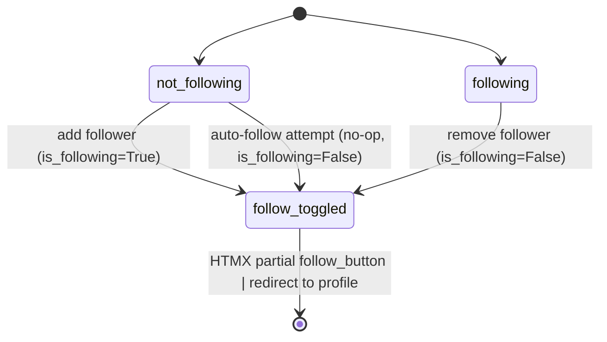
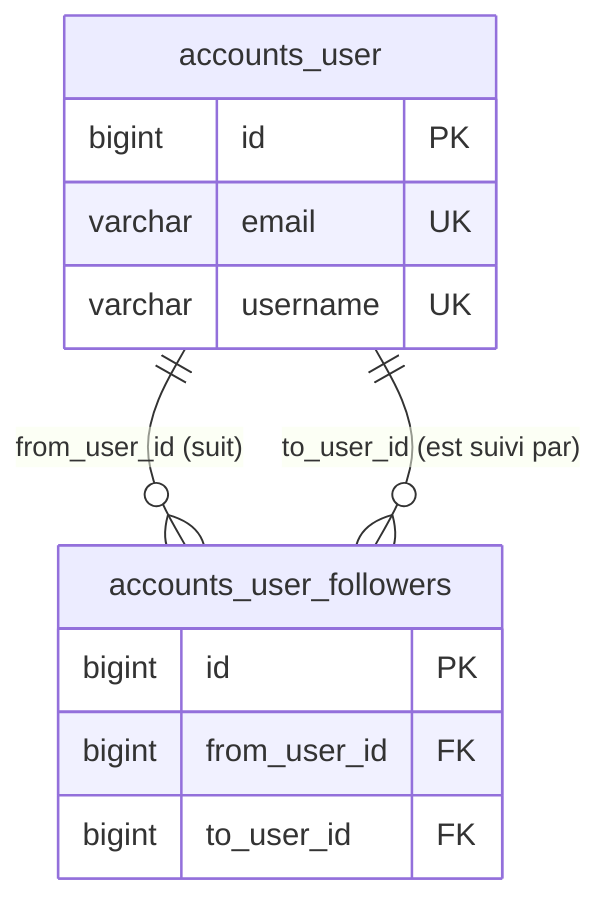

# Domaine : Profil & Social

[← Retour à l'index](../index.md)

---

## Vue d'ensemble

Le domaine social couvre les profils utilisateurs et le système de suivi (follow/unfollow). Les profils sont **entièrement publics** (lecture). Le suivi est un toggle asymétrique réservé aux utilisateurs authentifiés.

---

## Modules concernés

| Module | Fichier | Rôle |
|---|---|---|
| `accounts` | `apps/accounts/views.py` | profile_view, follow_view |
| `accounts` | `apps/accounts/models.py` | User.followers (M2M), is_following() |
| `templates` | `templates/partials/follow_button.html` | Bouton Follow/Unfollow (HTMX) |
| `templates` | `templates/accounts/profile.html` | Page profil |
| `helpers` | `helpers/htmx.py` | Détection requêtes HTMX |

---

## Règles métier associées

| ID | Résumé |
|---|---|
| [BR-010](../business_rules_index.md#br-010) | Relation asymétrique ; is_following(A,B) := A in B.followers |
| [BR-017](../business_rules_index.md#br-017) | Pagination profil : 10 articles/page |
| [BR-018](../business_rules_index.md#br-018) | Profil à 2 onglets: 'my articles' et 'favorites' |
| [BR-019](../business_rules_index.md#br-019) | Follow = toggle. Auto-follow = no-op silencieux |
| [BR-021](../business_rules_index.md#br-021) | Profil inexistant → 404 dédié avec username |
| [BR-052](../business_rules_index.md#br-052) | Bouton Follow caché sur son propre profil |

---

## Workflow

### WF-005 — Toggle Follow/Unfollow



**Étapes clés :**
1. `POST /profile/<username>/follow` (auth required)
2. `get_object_or_404(User, username=username)` → si utilisateur inconnu : 404
3. Si `profile_user == request.user` → no-op silencieux (`is_following=False`)
4. Si déjà suivi → `followers.remove(request.user)` → `is_following=False`
5. Sinon → `followers.add(request.user)` → `is_following=True`
6. HTMX → `partials/follow_button.html` ; sinon redirect `/profile/<username>`

---

## Page de profil

La page profil est accessible à tous (publique). Elle affiche :
- L'avatar (ou défaut `default-avatar.svg`)
- La bio
- Un bouton Follow/Unfollow (masqué sur son propre profil)
- Deux onglets d'articles paginés

### Onglets du profil

| Onglet | URL | Contenu | Tri |
|---|---|---|---|
| My Articles | `/profile/<username>` | Articles écrits par l'utilisateur | -created (décroissant) |
| Favorited Articles | `/profile/<username>/favorites` | Articles favorisés | -created (décroissant) |

**Pagination** : 10 articles/page via paramètre GET `?page=`. Valeur invalide → page 1.

---

## Modèle de la relation Follow



**Unicité** : contrainte UNIQUE sur `(from_user_id, to_user_id)` — impossible de suivre deux fois.

---

## Cas particuliers à connaître

| Situation | Comportement attendu |
|---|---|
| Utilisateur suit son propre compte | No-op silencieux, is_following=False, pas d'erreur |
| Username inexistant dans /follow | 404 Not Found |
| Profil inexistant | Page dédiée `accounts/profile_404.html` avec username — pas d'erreur générique |
| Non authentifié clique Follow | Redirect `/login` (@login_required) |

---

## Interface utilisateur — Bouton Follow

```html
<!-- Affiché seulement si authentifié ET on n'est pas sur son propre profil -->

  <button hx-post="follow">
    UnfollowFollow
    {{ profile_user.username }}
  </button>

```

---

## Tables de base de données concernées

| Table | Opérations | Description |
|---|---|---|
| `accounts_user` | READ | Données du profil |
| `accounts_user_followers` | READ, WRITE | Toggle follow/unfollow |
| `articles_article` | READ | Articles du profil/favoris |
| `articles_article_favorites` | READ | Onglet favoris |

---

## Routes concernées

| Route | Auth ? | Lien |
|---|---|---|
| GET /profile/<username> | Non | [Référence API](../api_reference.md#get-profileusername) |
| GET /profile/<username>/favorites | Non | [Référence API](../api_reference.md#get-profileusernamefavorites) |
| POST /profile/<username>/follow | **Oui** | [Référence API](../api_reference.md#post-profileusernamefollow) |

---

## Notes pour la migration vers Angular/Fastify

1. **Relation follower asymétrique** : Sequelize avec `belongsToMany(User, { through: 'UserFollowers', as: 'followers' })` avec `symmetrical: false`.
2. **`is_following()`** : méthode à implémenter comme query : `followers.filter(pk=currentUser.id).exists()`.
3. **Auto-follow = no-op** : le guard doit vérifier `profileUserId !== currentUser.id` avant toute modification. Si égaux → retourner `{ is_following: false }` sans modifier la DB.
4. **Onglets profil** : deux endpoints distincts (ou un paramètre `tab=my|favorites`) dans la cible Angular.

---

*[← Commentaires](./comments.md) | [Index →](../index.md)*
