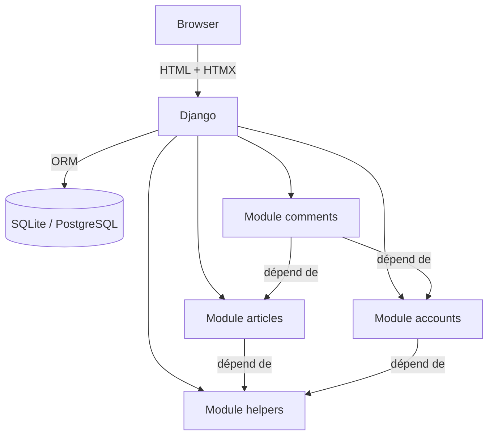

# Conduit — Documentation de Migration

> **Projet** : conduit  
> **Source** : Python / Django 5.2 + HTMX  
> **Cible** : TypeScript / Angular + Fastify + Sequelize  
> **Généré par** : Agent 08-documenteur — 2026-04-13  
> **Confiance globale** : 93 %

---

## À propos de ce document

Ce référentiel est la **source de vérité unique** pour toute la migration. Il consolide les résultats des agents 01 à 07 en documentation navigable par domaine métier. Il est destiné à la fois aux développeurs et aux responsables métier pour valider la complétude fonctionnelle avant et après migration.

---

## Navigation

### Vue d'ensemble
| Document | Description |
|---|---|
| [Architecture](./architecture.md) | Structure technique, modules, dépendances, diagrammes |
| [Modèle de données](./data_model.md) | Schéma de base de données avec diagramme ER |
| [Référence API](./api_reference.md) | Toutes les routes HTTP avec paramètres et réponses |
| [Index des règles métier](./business_rules_index.md) | Les 54 règles métier classées par domaine |
| [Points d'attention](./attention_points.md) | Risques, anomalies et blockers classés par sévérité |

### Domaines métier
| Domaine | Workflows | Règles métier | Routes |
|---|---|---|---|
| [Authentification](./domains/authentication.md) | WF-001, WF-002, WF-003, WF-004 | BR-003 à BR-021 | 6 routes |
| [Articles](./domains/articles.md) | WF-006, WF-007, WF-008, WF-009 | BR-022 à BR-038 | 10 routes |
| [Commentaires](./domains/comments.md) | WF-010, WF-011 | BR-039 à BR-044 | 2 routes |
| [Profil & Social](./domains/social.md) | WF-005 | BR-010, BR-017 à BR-019 | 3 routes |

---

## Résumé de l'application

**Conduit** est une plateforme de publication d'articles (clone du spec [RealWorld](https://github.com/gothinkster/realworld)).

### Ce que fait l'application
- Les utilisateurs peuvent **s'inscrire** et **se connecter** avec email + mot de passe
- Ils peuvent **publier des articles** avec titre, description, contenu Markdown et tags
- Ils peuvent **commenter** les articles des autres
- Ils peuvent **favoriser** des articles
- Ils peuvent **suivre** d'autres utilisateurs et voir un fil personnalisé
- Les contenus (articles, profils) sont **publics** ; les actions sont protégées

### Architecture en un coup d'œil

### Chiffres clés

| Indicateur | Valeur |
|---|---|
| Fichiers Python | 49 |
| Lignes de code | 1 651 (dont 1 005 Python, 600 HTML) |
| Routes HTTP | 23 backend + 11 pages frontend |
| Tables en base | 9 (7 applicatives + 2 taggit) |
| Règles métier | 54 |
| Workflows | 11 |
| Permissions | 34 |
| Rôles | 3 (anonymous, authenticated, staff) |

---

## Points d'attention critiques

> ⚠️ **Lire avant tout travail de migration**

1. **[WARN]** L'endpoint `POST /logout` n'est pas protégé par `@login_required` → voir [attention_points.md](./attention_points.md#anomalie-1)
2. **[INFO]** Les articles non-propriétaires retournent **404** (pas 403) — comportement intentionnel à reproduire → [BR-034](./business_rules_index.md#br-034), [BR-035](./business_rules_index.md#br-035)
3. **[INFO]** La suppression de commentaire autorise **auteur du commentaire OU auteur de l'article** → [BR-041](./business_rules_index.md#br-041)
4. **[RÉSOLU]** Validateurs de mot de passe configurés mais non appliqués → comportement voulu, ne pas migrer → [BR-004](./business_rules_index.md#br-004)

---

*Tous les fichiers utilisent des liens relatifs.  
Pour la liste des inconsistances et questions humaines résolues, voir [attention_points.md](./attention_points.md).*
